# Chart gallery

Every chart below is a plain Filament widget: a class that extends `EnhancedChartWidget` and returns an `Option` built from typed PHP objects — series, axes, components and styles — instead of hand-written option arrays. Each one is shown in light and dark mode (dark mode is automatic, the code is the same) and comes with its full widget class.

[← Back to the README](README.md)

## Contents

- **[Line](#line)** — [Smooth area with a mark point](#smooth-area-with-a-mark-point), [Stacked areas with a side legend](#stacked-areas-with-a-side-legend), [Step lines with a mark line](#step-lines-with-a-mark-line)
- **[Bar](#bar)** — [Grouped bars](#grouped-bars), [Horizontal stacked bars](#horizontal-stacked-bars), [Polar bars](#polar-bars)
- **[Pie](#pie)** — [Nightingale rose](#nightingale-rose), [Donut](#donut), [Half donut](#half-donut)
- **[Scatter](#scatter)** — [Bubble chart](#bubble-chart)
- **[Effect scatter](#effect-scatter)** — [Pulsing outliers (animated)](#pulsing-outliers-animated)
- **[Candlestick](#candlestick)** — [Candles with a moving average](#candles-with-a-moving-average), [With a data-zoom slider](#with-a-data-zoom-slider)
- **[Boxplot](#boxplot)** — [Distribution per category](#distribution-per-category)
- **[Heatmap](#heatmap)** — [Cartesian heatmap](#cartesian-heatmap), [Calendar heatmap](#calendar-heatmap)
- **[Radar](#radar)** — [Circle radar](#circle-radar), [Polygon radar](#polygon-radar)
- **[Gauge](#gauge)** — [Speedometer](#speedometer), [Progress rings](#progress-rings)
- **[Funnel](#funnel)** — [Checkout funnel](#checkout-funnel), [Pyramid](#pyramid)
- **[Sankey](#sankey)** — [Horizontal sankey](#horizontal-sankey), [Vertical sankey](#vertical-sankey)
- **[Sunburst](#sunburst)** — [Three-level sunburst](#three-level-sunburst)
- **[Treemap](#treemap)** — [Two-level treemap](#two-level-treemap)
- **[Tree](#tree)** — [Horizontal tree](#horizontal-tree), [Vertical tree](#vertical-tree), [Radial tree](#radial-tree)
- **[Graph](#graph)** — [Circular layout](#circular-layout), [Force layout (animated)](#force-layout-animated)
- **[Parallel](#parallel)** — [Parallel coordinates](#parallel-coordinates)
- **[Theme river](#theme-river)** — [Streams over time](#streams-over-time)
- **[Pictorial bar](#pictorial-bar)** — [Repeated symbols](#repeated-symbols)
- **[Map](#map)** — [Hexagonal tile map](#hexagonal-tile-map)
- **[Lines](#lines)** — [Animated routes on a map](#animated-routes-on-a-map)
- **[Chord](#chord)** — [Chord diagram](#chord-diagram)
- **[Custom](#custom)** — [Gantt chart via renderItem](#gantt-chart-via-renderitem)

## Line

`LineSeries` — Trends over a category or time axis — smooth, stacked, stepped or filled.

### Smooth area with a mark point

_Revenue vs target — Monthly recurring revenue, k€_

| Light | Dark |
|:---:|:---:|
| 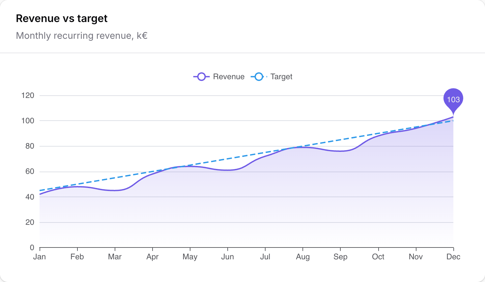 | 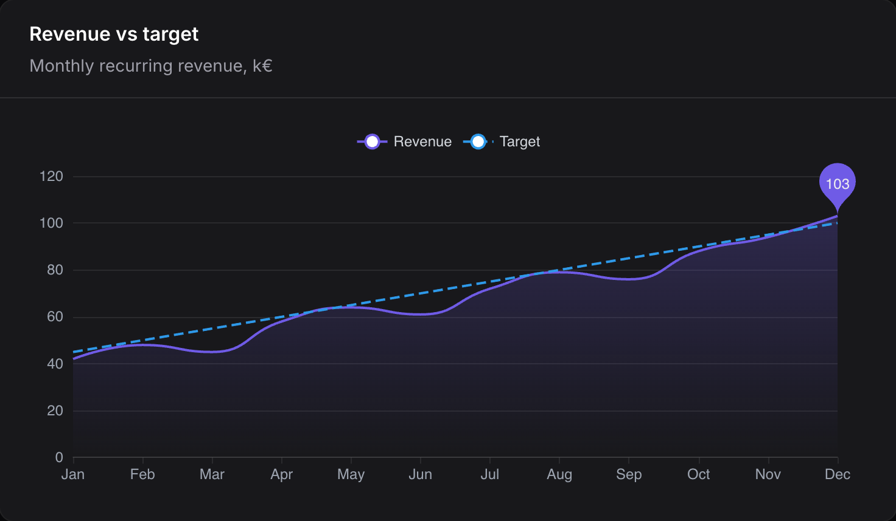 |

<details>
<summary>Widget code</summary>

```php
use Happenv\FilamentEnhancedCharts\Option\Axis\CategoryAxis;
use Happenv\FilamentEnhancedCharts\Option\Mark\MarkPoint;
use Happenv\FilamentEnhancedCharts\Option\Option;
use Happenv\FilamentEnhancedCharts\Option\Series\LineSeries;
use Happenv\FilamentEnhancedCharts\Option\Style\AreaStyle;
use Happenv\FilamentEnhancedCharts\Widgets\EnhancedChartWidget;

class LineChart extends EnhancedChartWidget
{
    protected static ?string $heading = 'Revenue vs target';

    protected static ?string $subheading = 'Monthly recurring revenue, k€';

    protected ?string $pollingInterval = null;

    protected function getOption(): Option
    {
        return Option::cartesian()
            ->xAxis(CategoryAxis::make()->boundaryGap(false)->data(['Jan', 'Feb', 'Mar', 'Apr', 'May', 'Jun', 'Jul', 'Aug', 'Sep', 'Oct', 'Nov', 'Dec']))
            ->series(
                LineSeries::make()
                    ->name('Revenue')
                    ->smooth()
                    ->showSymbol(false)
                    ->color('#6f5be6')
                    ->areaStyle(AreaStyle::make()->color([
                        'type' => 'linear', 'x' => 0, 'y' => 0, 'x2' => 0, 'y2' => 1,
                        'colorStops' => [['offset' => 0, 'color' => 'rgba(111, 91, 230, 0.35)'], ['offset' => 1, 'color' => 'rgba(111, 91, 230, 0)']],
                    ]))
                    ->markPoint(MarkPoint::make()->data([['type' => 'max', 'name' => 'Peak']]))
                    ->data([42, 48, 45, 58, 64, 61, 72, 79, 76, 88, 94, 103]),
                LineSeries::make()
                    ->name('Target')
                    ->dashed()
                    ->showSymbol(false)
                    ->color('#2e99e9')
                    ->data([45, 50, 55, 60, 65, 70, 75, 80, 85, 90, 95, 100]),
            );
    }
}
```

</details>

### Stacked areas with a side legend

_Signups by channel — Stacked areas with a vertical legend on the right_

| Light | Dark |
|:---:|:---:|
| 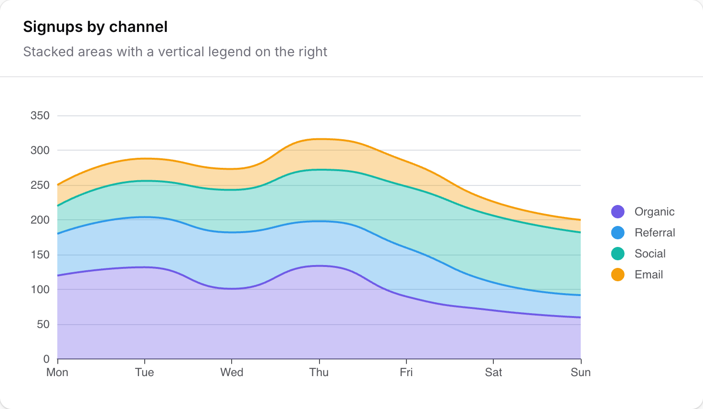 | 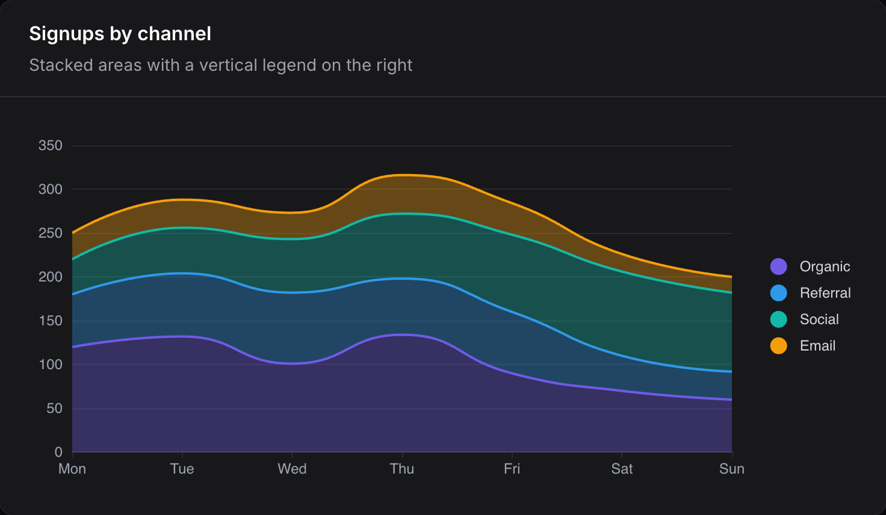 |

<details>
<summary>Widget code</summary>

```php
use Happenv\FilamentEnhancedCharts\Option\Axis\CategoryAxis;
use Happenv\FilamentEnhancedCharts\Option\Component\Legend;
use Happenv\FilamentEnhancedCharts\Option\Option;
use Happenv\FilamentEnhancedCharts\Option\Series\LineSeries;
use Happenv\FilamentEnhancedCharts\Option\Style\AreaStyle;
use Happenv\FilamentEnhancedCharts\Widgets\EnhancedChartWidget;

class LineStackedAreaChart extends EnhancedChartWidget
{
    protected static ?string $heading = 'Signups by channel';

    protected static ?string $subheading = 'Stacked areas with a vertical legend on the right';

    protected ?string $pollingInterval = null;

    protected function getOption(): Option
    {
        $area = fn (string $name, string $color, array $data): LineSeries => LineSeries::make()
            ->name($name)->color($color)->stack('signups')->smooth()->showSymbol(false)
            ->areaStyle(AreaStyle::make()->opacity(0.35))->data($data);

        return Option::cartesian()
            ->legend(Legend::make()->orient('vertical')->right(0)->top('middle')->icon('circle'))
            ->xAxis(CategoryAxis::make()->boundaryGap(false)->data(['Mon', 'Tue', 'Wed', 'Thu', 'Fri', 'Sat', 'Sun']))
            ->series(
                $area('Organic', '#6f5be6', [120, 132, 101, 134, 90, 70, 60]),
                $area('Referral', '#2e99e9', [60, 72, 81, 64, 70, 40, 32]),
                $area('Social', '#14b8a6', [40, 52, 61, 74, 88, 96, 90]),
                $area('Email', '#f59e0b', [30, 32, 30, 44, 36, 20, 18]),
            );
    }
}
```

</details>

### Step lines with a mark line

_Active servers — Step lines with a capacity mark line, legend at the bottom_

| Light | Dark |
|:---:|:---:|
| 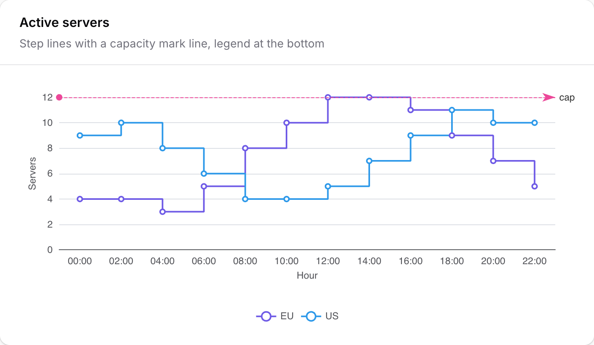 | 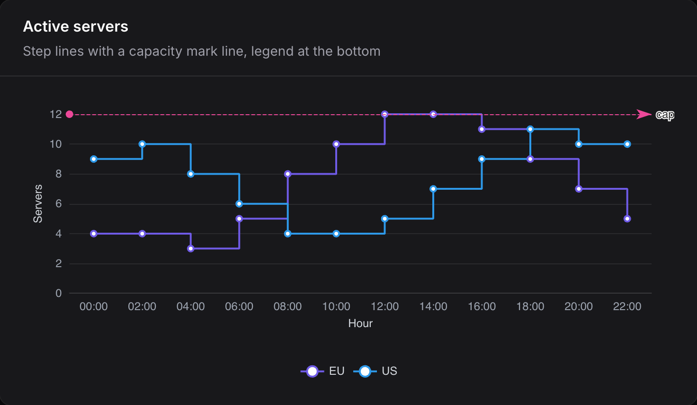 |

<details>
<summary>Widget code</summary>

```php
use Happenv\FilamentEnhancedCharts\Option\Axis\CategoryAxis;
use Happenv\FilamentEnhancedCharts\Option\Axis\ValueAxis;
use Happenv\FilamentEnhancedCharts\Option\Component\Legend;
use Happenv\FilamentEnhancedCharts\Option\Mark\MarkLine;
use Happenv\FilamentEnhancedCharts\Option\Option;
use Happenv\FilamentEnhancedCharts\Option\Series\LineSeries;
use Happenv\FilamentEnhancedCharts\Widgets\EnhancedChartWidget;

class LineStepChart extends EnhancedChartWidget
{
    protected static ?string $heading = 'Active servers';

    protected static ?string $subheading = 'Step lines with a capacity mark line, legend at the bottom';

    protected ?string $pollingInterval = null;

    protected function getOption(): Option
    {
        $hours = array_map(fn (int $h): string => sprintf('%02d:00', $h), range(0, 23, 2));

        return Option::cartesian()
            ->legend(Legend::make()->bottom(0))
            ->xAxis(CategoryAxis::make()->name('Hour')->data($hours))
            ->yAxis(ValueAxis::make()->name('Servers'))
            ->series(
                LineSeries::make()->name('EU')->step('end')->color('#6f5be6')->data([4, 4, 3, 5, 8, 10, 12, 12, 11, 9, 7, 5])
                    ->markLine(MarkLine::make()->data([['yAxis' => 12, 'name' => 'Capacity']])->raw(['lineStyle' => ['color' => '#ec4899'], 'label' => ['formatter' => 'capacity']])),
                LineSeries::make()->name('US')->step('end')->color('#2e99e9')->data([9, 10, 8, 6, 4, 4, 5, 7, 9, 11, 10, 10]),
            );
    }
}
```

</details>

[↑ Contents](#contents)

## Bar

`BarSeries` — Vertical, horizontal, stacked or on a polar grid.

### Grouped bars

_Orders per quarter — Grouped bars, web vs retail_

| Light | Dark |
|:---:|:---:|
| 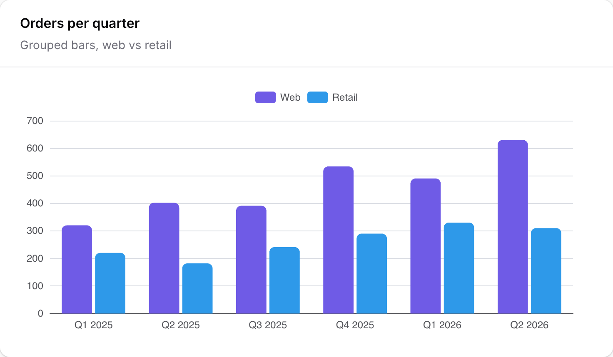 | 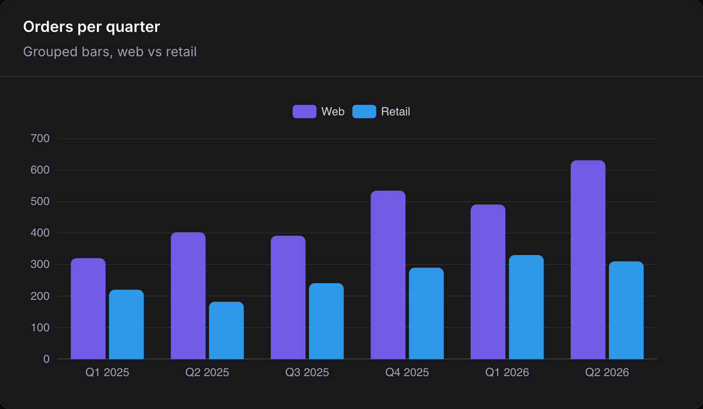 |

<details>
<summary>Widget code</summary>

```php
use Happenv\FilamentEnhancedCharts\Option\Axis\CategoryAxis;
use Happenv\FilamentEnhancedCharts\Option\Option;
use Happenv\FilamentEnhancedCharts\Option\Series\BarSeries;
use Happenv\FilamentEnhancedCharts\Option\Style\ItemStyle;
use Happenv\FilamentEnhancedCharts\Widgets\EnhancedChartWidget;

class BarChart extends EnhancedChartWidget
{
    protected static ?string $heading = 'Orders per quarter';

    protected static ?string $subheading = 'Grouped bars, web vs retail';

    protected ?string $pollingInterval = null;

    protected function getOption(): Option
    {
        $rounded = ItemStyle::make()->borderRadius([6, 6, 0, 0]);

        return Option::cartesian()
            ->xAxis(CategoryAxis::make()->data(['Q1 2025', 'Q2 2025', 'Q3 2025', 'Q4 2025', 'Q1 2026', 'Q2 2026']))
            ->series(
                BarSeries::make()->name('Web')->color('#6f5be6')->itemStyle($rounded)->barGap('10%')->data([320, 402, 391, 534, 490, 630]),
                BarSeries::make()->name('Retail')->color('#2e99e9')->itemStyle($rounded)->data([220, 182, 241, 290, 330, 310]),
            );
    }
}
```

</details>

### Horizontal stacked bars

_Time spent per team — Horizontal stacked bars, hours this week_

| Light | Dark |
|:---:|:---:|
| 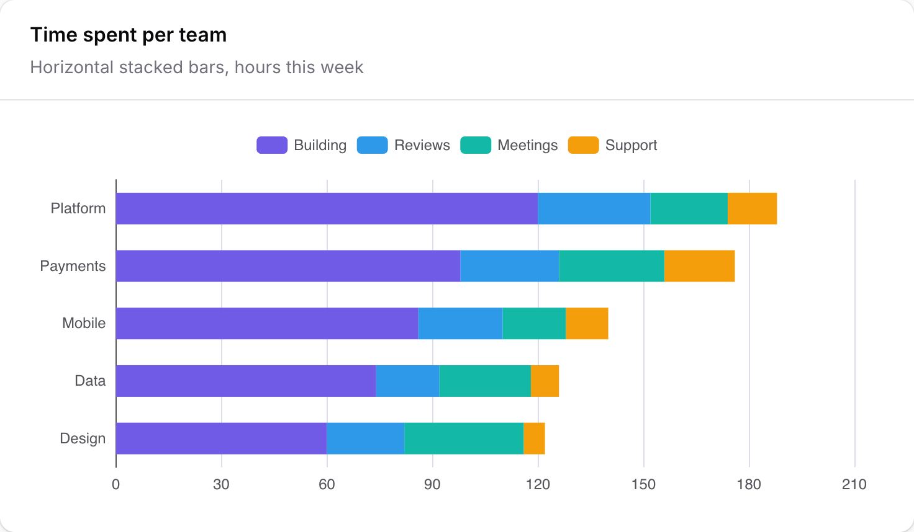 | 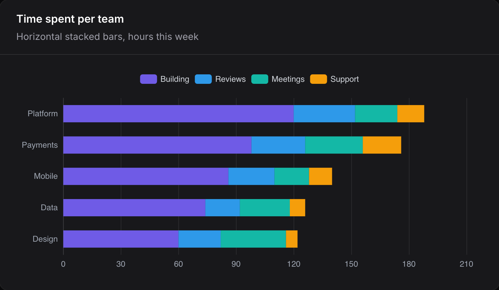 |

<details>
<summary>Widget code</summary>

```php
use Happenv\FilamentEnhancedCharts\Option\Axis\CategoryAxis;
use Happenv\FilamentEnhancedCharts\Option\Axis\ValueAxis;
use Happenv\FilamentEnhancedCharts\Option\Option;
use Happenv\FilamentEnhancedCharts\Option\Series\BarSeries;
use Happenv\FilamentEnhancedCharts\Widgets\EnhancedChartWidget;

class BarHorizontalStackedChart extends EnhancedChartWidget
{
    protected static ?string $heading = 'Time spent per team';

    protected static ?string $subheading = 'Horizontal stacked bars, hours this week';

    protected ?string $pollingInterval = null;

    protected function getOption(): Option
    {
        $bar = fn (string $name, string $color, array $data): BarSeries => BarSeries::make()
            ->name($name)->color($color)->stack('hours')->barWidth('55%')->data($data);

        return Option::cartesian()
            ->xAxis(ValueAxis::make())
            ->yAxis(CategoryAxis::make()->inverse()->data(['Platform', 'Payments', 'Mobile', 'Data', 'Design']))
            ->series(
                $bar('Building', '#6f5be6', [120, 98, 86, 74, 60]),
                $bar('Reviews', '#2e99e9', [32, 28, 24, 18, 22]),
                $bar('Meetings', '#14b8a6', [22, 30, 18, 26, 34]),
                $bar('Support', '#f59e0b', [14, 20, 12, 8, 6]),
            );
    }
}
```

</details>

### Polar bars

_Traffic by hour — Sessions around the clock_

| Light | Dark |
|:---:|:---:|
| 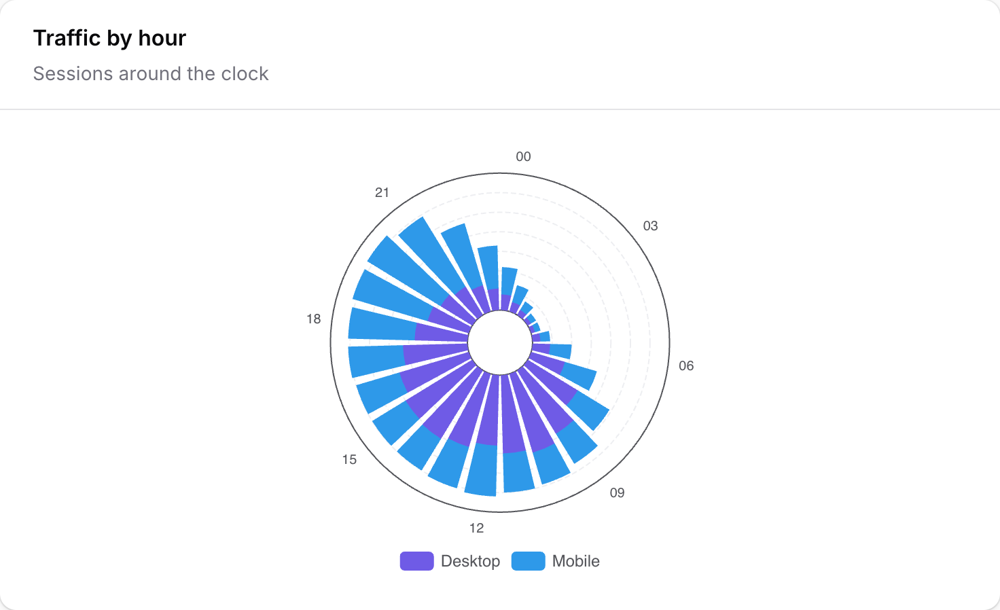 | 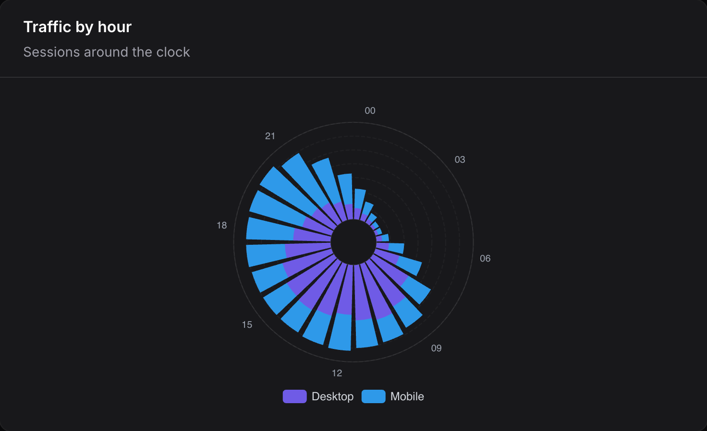 |

<details>
<summary>Widget code</summary>

```php
use Happenv\FilamentEnhancedCharts\Option\Component\AngleAxis;
use Happenv\FilamentEnhancedCharts\Option\Component\Legend;
use Happenv\FilamentEnhancedCharts\Option\Component\Polar;
use Happenv\FilamentEnhancedCharts\Option\Component\RadiusAxis;
use Happenv\FilamentEnhancedCharts\Option\Component\Tooltip;
use Happenv\FilamentEnhancedCharts\Option\Option;
use Happenv\FilamentEnhancedCharts\Option\Series\BarSeries;
use Happenv\FilamentEnhancedCharts\Widgets\EnhancedChartWidget;

class HourlyTrafficChart extends EnhancedChartWidget
{
    protected static ?string $heading = 'Traffic by hour';

    protected static ?string $subheading = 'Sessions around the clock';

    protected static int $contentHeight = 320;

    protected ?string $pollingInterval = null;

    protected function getOption(): Option
    {
        $hours = array_map(fn (int $h): string => str_pad((string) $h, 2, '0', STR_PAD_LEFT), range(0, 23));
        $desktop = [8, 5, 3, 2, 2, 4, 9, 18, 30, 38, 42, 40, 36, 39, 41, 40, 37, 33, 27, 22, 19, 17, 14, 11];
        $mobile = [14, 9, 5, 3, 3, 5, 11, 17, 19, 18, 17, 20, 26, 22, 19, 20, 23, 28, 34, 40, 44, 42, 33, 22];

        return Option::make()
            ->tooltip(Tooltip::make()->trigger('axis'))
            ->legend(Legend::make()->bottom(0))
            ->polar(Polar::make()->radius([24, '78%'])->center(['50%', '46%']))
            ->angleAxis(AngleAxis::make()->type('category')->data($hours)->startAngle(90)->axisLabel(['interval' => 2, 'fontSize' => 10])->axisTick(false))
            ->radiusAxis(RadiusAxis::make()->axisLabel(['show' => false])->axisLine(false)->axisTick(false)->splitLine(['lineStyle' => ['type' => 'dashed', 'opacity' => 0.5]]))
            ->series(
                BarSeries::make()->name('Desktop')->coordinateSystem('polar')->stack('sessions')->roundCap()->color('#6f5be6')->data($desktop),
                BarSeries::make()->name('Mobile')->coordinateSystem('polar')->stack('sessions')->roundCap()->color('#2e99e9')->data($mobile),
            );
    }
}
```

</details>

[↑ Contents](#contents)

## Pie

`PieSeries` — Share of a whole — classic, donut, half donut or Nightingale rose.

### Nightingale rose

_Traffic sources — Nightingale rose, sessions per channel_

| Light | Dark |
|:---:|:---:|
| 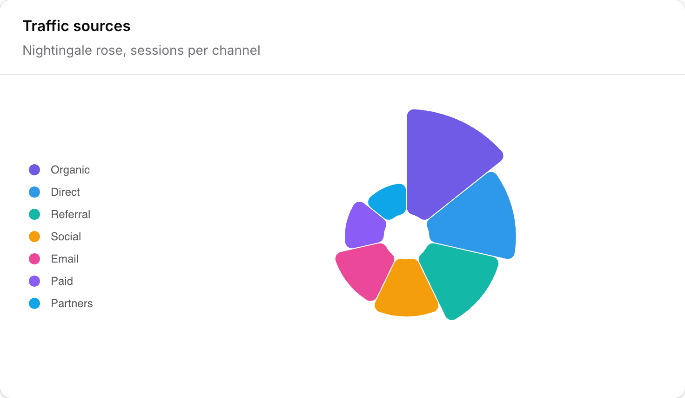 | 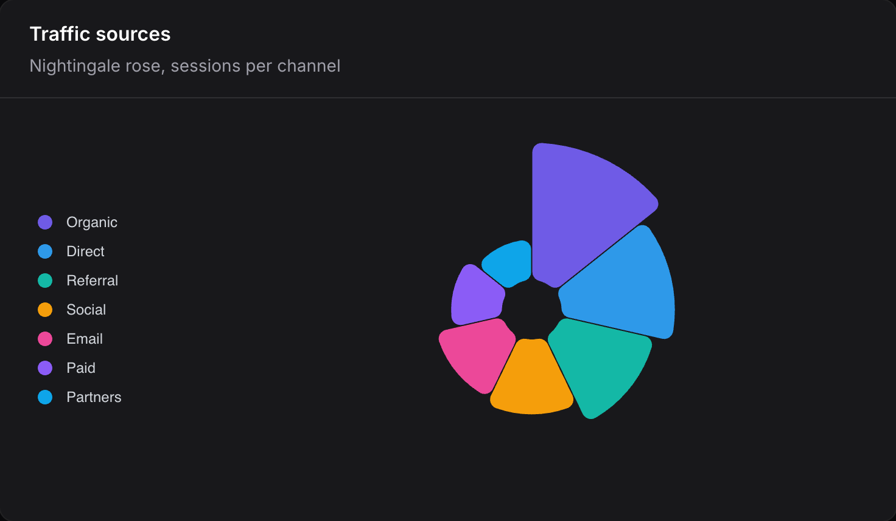 |

<details>
<summary>Widget code</summary>

```php
use Happenv\FilamentEnhancedCharts\Option\Component\Legend;
use Happenv\FilamentEnhancedCharts\Option\Component\Tooltip;
use Happenv\FilamentEnhancedCharts\Option\DataPoint;
use Happenv\FilamentEnhancedCharts\Option\Option;
use Happenv\FilamentEnhancedCharts\Option\Series\PieSeries;
use Happenv\FilamentEnhancedCharts\Option\Style\ItemStyle;
use Happenv\FilamentEnhancedCharts\Widgets\EnhancedChartWidget;

class PieChart extends EnhancedChartWidget
{
    protected static ?string $heading = 'Traffic sources';

    protected static ?string $subheading = 'Nightingale rose, sessions per channel';

    protected ?string $pollingInterval = null;

    protected function getOption(): Option
    {
        return Option::make()
            ->color('#6f5be6', '#2e99e9', '#14b8a6', '#f59e0b', '#ec4899', '#8b5cf6', '#0ea5e9')
            ->tooltip(Tooltip::make()->trigger('item'))
            ->legend(Legend::make()->orient('vertical')->left(0)->top('middle')->icon('circle'))
            ->series(
                PieSeries::make()
                    ->name('Sessions')
                    ->roseType('area')
                    ->radius([24, '92%'])
                    ->center(['60%', '50%'])
                    ->itemStyle(ItemStyle::make()->borderRadius(8))
                    ->label(['show' => false])
                    ->data([
                        DataPoint::make(40)->name('Organic'),
                        DataPoint::make(33)->name('Direct'),
                        DataPoint::make(28)->name('Referral'),
                        DataPoint::make(22)->name('Social'),
                        DataPoint::make(20)->name('Email'),
                        DataPoint::make(15)->name('Paid'),
                        DataPoint::make(12)->name('Partners'),
                    ]),
            );
    }
}
```

</details>

### Donut

_Revenue by plan — Donut with padded slices, legend at the bottom_

| Light | Dark |
|:---:|:---:|
| 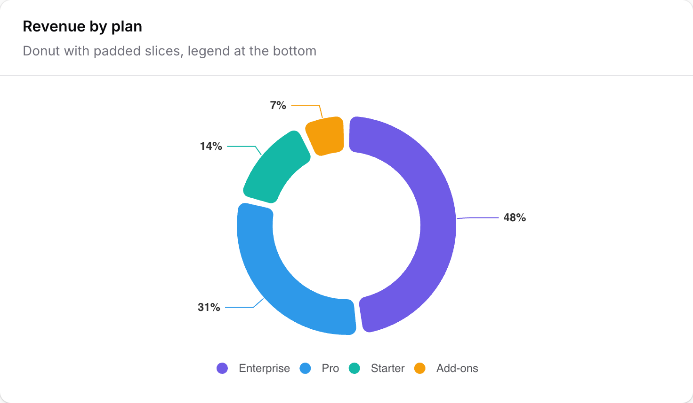 | 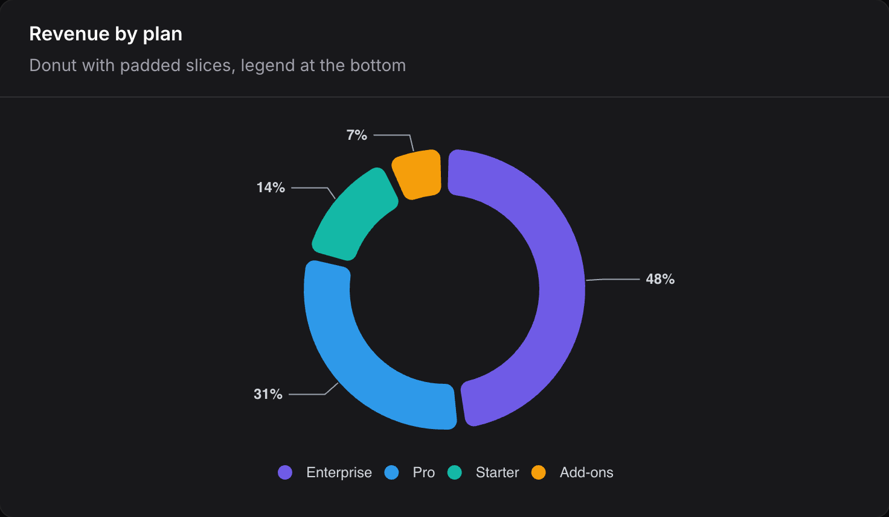 |

<details>
<summary>Widget code</summary>

```php
use Happenv\FilamentEnhancedCharts\Option\Component\Legend;
use Happenv\FilamentEnhancedCharts\Option\Component\Tooltip;
use Happenv\FilamentEnhancedCharts\Option\DataPoint;
use Happenv\FilamentEnhancedCharts\Option\Option;
use Happenv\FilamentEnhancedCharts\Option\Series\PieSeries;
use Happenv\FilamentEnhancedCharts\Option\Style\ItemStyle;
use Happenv\FilamentEnhancedCharts\Option\Style\Label;
use Happenv\FilamentEnhancedCharts\Widgets\EnhancedChartWidget;

class PieDonutChart extends EnhancedChartWidget
{
    protected static ?string $heading = 'Revenue by plan';

    protected static ?string $subheading = 'Donut with padded slices, legend at the bottom';

    protected ?string $pollingInterval = null;

    protected function getOption(): Option
    {
        return Option::make()
            ->color('#6f5be6', '#2e99e9', '#14b8a6', '#f59e0b')
            ->tooltip(Tooltip::make()->trigger('item'))
            ->legend(Legend::make()->bottom(0)->icon('circle'))
            ->series(
                PieSeries::make()
                    ->radius(['52%', '78%'])
                    ->center(['50%', '45%'])
                    ->padAngle(3)
                    ->itemStyle(ItemStyle::make()->borderRadius(8))
                    ->label(Label::make()->formatter('{d}%')->fontWeight(600))
                    ->data([
                        DataPoint::make(48)->name('Enterprise'),
                        DataPoint::make(31)->name('Pro'),
                        DataPoint::make(14)->name('Starter'),
                        DataPoint::make(7)->name('Add-ons'),
                    ]),
            );
    }
}
```

</details>

### Half donut

_Survey answers — Half donut with a vertical legend on the left_

| Light | Dark |
|:---:|:---:|
| 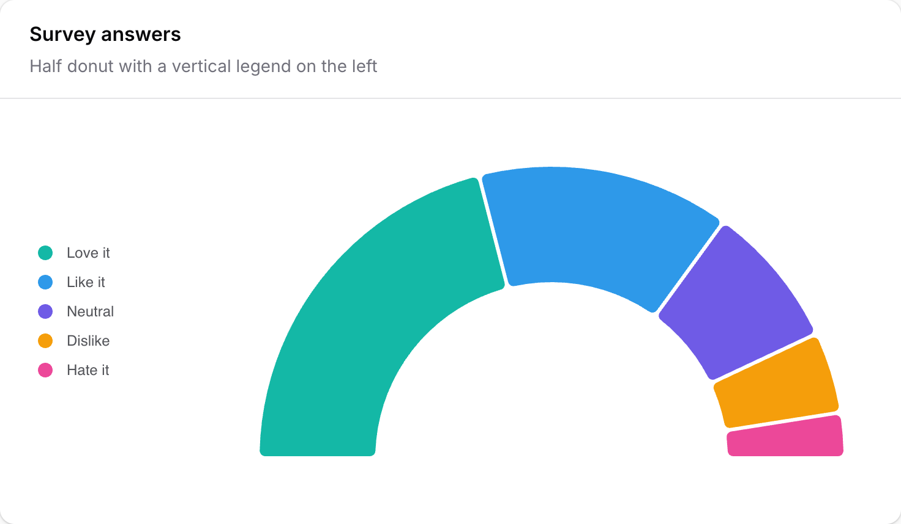 | 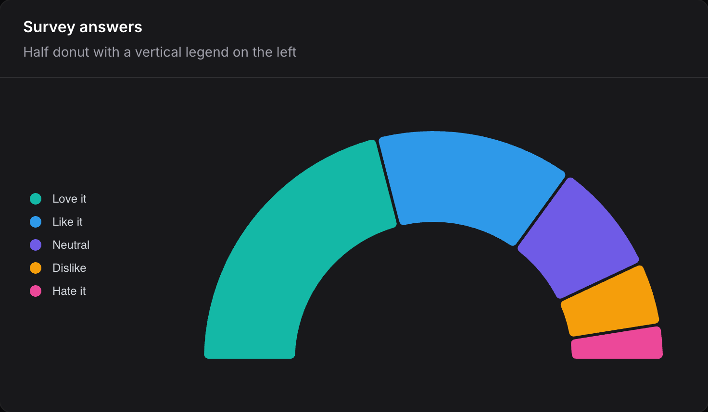 |

<details>
<summary>Widget code</summary>

```php
use Happenv\FilamentEnhancedCharts\Option\Component\Legend;
use Happenv\FilamentEnhancedCharts\Option\DataPoint;
use Happenv\FilamentEnhancedCharts\Option\Option;
use Happenv\FilamentEnhancedCharts\Option\Series\PieSeries;
use Happenv\FilamentEnhancedCharts\Option\Style\ItemStyle;
use Happenv\FilamentEnhancedCharts\Widgets\EnhancedChartWidget;

class PieHalfDonutChart extends EnhancedChartWidget
{
    protected static ?string $heading = 'Survey answers';

    protected static ?string $subheading = 'Half donut with a vertical legend on the left';

    protected ?string $pollingInterval = null;

    protected function getOption(): Option
    {
        return Option::make()
            ->color('#14b8a6', '#2e99e9', '#6f5be6', '#f59e0b', '#ec4899')
            ->legend(Legend::make()->orient('vertical')->left(0)->top('middle')->icon('circle'))
            ->series(
                PieSeries::make()
                    ->radius(['95%', '160%'])
                    ->center(['62%', '90%'])
                    ->startAngle(180)
                    ->endAngle(360)
                    ->itemStyle(ItemStyle::make()->borderRadius(6)->borderWidth(3))
                    ->label(['show' => false])
                    ->data([
                        DataPoint::make(42)->name('Love it'),
                        DataPoint::make(28)->name('Like it'),
                        DataPoint::make(16)->name('Neutral'),
                        DataPoint::make(9)->name('Dislike'),
                        DataPoint::make(5)->name('Hate it'),
                    ]),
            );
    }
}
```

</details>

[↑ Contents](#contents)

## Scatter

`ScatterSeries` — Points on two value axes; symbol size can carry a third dimension.

### Bubble chart

_Customer segments — Orders × basket value, bubble = lifetime value_

| Light | Dark |
|:---:|:---:|
| 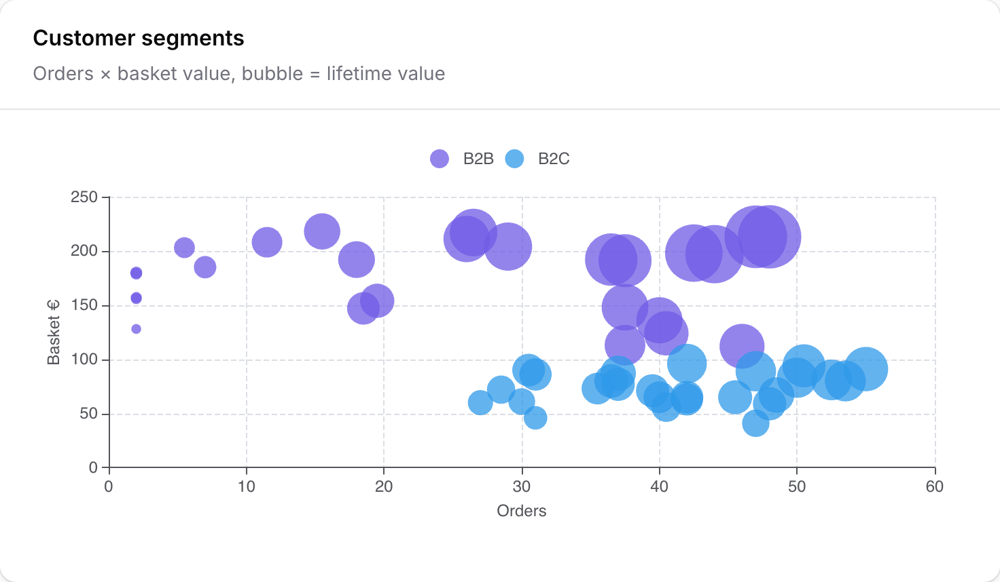 | 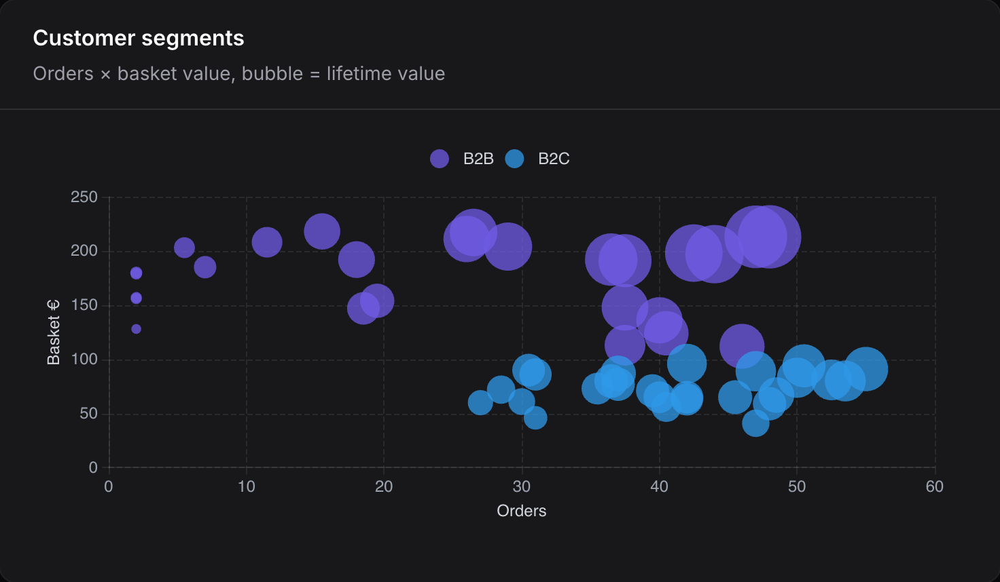 |

<details>
<summary>Widget code</summary>

```php
use Filament\Support\RawJs;
use Happenv\FilamentEnhancedCharts\Option\Axis\ValueAxis;
use Happenv\FilamentEnhancedCharts\Option\Component\Legend;
use Happenv\FilamentEnhancedCharts\Option\Component\Tooltip;
use Happenv\FilamentEnhancedCharts\Option\Option;
use Happenv\FilamentEnhancedCharts\Option\Series\ScatterSeries;
use Happenv\FilamentEnhancedCharts\Option\Style\ItemStyle;
use Happenv\FilamentEnhancedCharts\Widgets\EnhancedChartWidget;

class ScatterChart extends EnhancedChartWidget
{
    protected static ?string $heading = 'Customer segments';

    protected static ?string $subheading = 'Orders × basket value, bubble = lifetime value';

    protected ?string $pollingInterval = null;

    protected function getOption(): Option
    {
        $bubble = RawJs::make('(value) => Math.sqrt(value[2]) * 1.6');

        return Option::make()
            ->tooltip(Tooltip::make()->trigger('item'))
            ->legend(Legend::make()->top(0))
            ->xAxis(ValueAxis::make()->name('Orders')->splitLine(['lineStyle' => ['type' => 'dashed']]))
            ->yAxis(ValueAxis::make()->name('Basket €')->splitLine(['lineStyle' => ['type' => 'dashed']]))
            ->series(
                ScatterSeries::make()->name('B2B')->color('#6f5be6')->symbolSize($bubble)
                    ->itemStyle(ItemStyle::make()->opacity(0.75))
                    ->data($this->segment(11, 18, 160, 60)),
                ScatterSeries::make()->name('B2C')->color('#2e99e9')->symbolSize($bubble)
                    ->itemStyle(ItemStyle::make()->opacity(0.75))
                    ->data($this->segment(12, 42, 70, 30)),
            );
    }

    /** @return list<array{int, int, int}> */
    private function segment(int $seed, int $orders, int $basket, int $spread): array
    {
        mt_srand($seed);

        return array_map(fn (): array => [
            $o = max(2, $orders + mt_rand(-$spread, $spread) / 2),
            $b = max(10, $basket + mt_rand(-$spread, $spread)),
            (int) ($o * $b / 12),
        ], range(1, 26));
    }
}
```

</details>

[↑ Contents](#contents)

## Effect scatter

`EffectScatterSeries` — Scatter points with a ripple animation to draw the eye.

### Pulsing outliers (animated)

_Latency anomalies — p95 response time, ms — outliers pulse_

| Light | Dark |
|:---:|:---:|
| 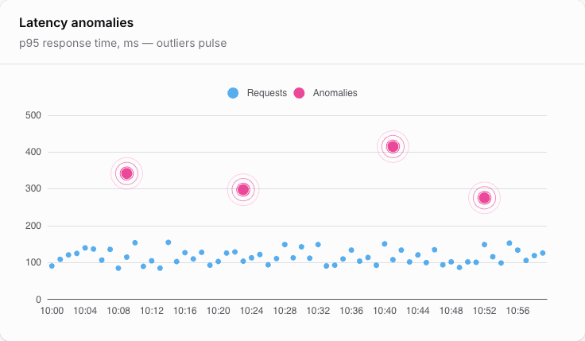 | 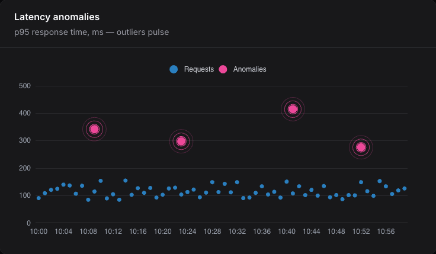 |

<details>
<summary>Widget code</summary>

```php
use Happenv\FilamentEnhancedCharts\Option\Axis\CategoryAxis;
use Happenv\FilamentEnhancedCharts\Option\Component\Legend;
use Happenv\FilamentEnhancedCharts\Option\Option;
use Happenv\FilamentEnhancedCharts\Option\Series\EffectScatterSeries;
use Happenv\FilamentEnhancedCharts\Option\Series\ScatterSeries;
use Happenv\FilamentEnhancedCharts\Widgets\EnhancedChartWidget;

class EffectScatterChart extends EnhancedChartWidget
{
    protected static ?string $heading = 'Latency anomalies';

    protected static ?string $subheading = 'p95 response time, ms — outliers pulse';

    protected ?string $pollingInterval = null;

    protected function getOption(): Option
    {
        mt_srand(7);
        $normal = array_map(fn (int $i): array => [$i, 120 + mt_rand(-35, 35)], range(0, 59));
        $anomalies = [[9, 342], [23, 298], [41, 415], [52, 276]];

        return Option::cartesian()
            ->legend(Legend::make()->top(0))
            ->xAxis(CategoryAxis::make()->data(array_map(fn (int $m): string => sprintf('10:%02d', $m), range(0, 59))))
            ->series(
                ScatterSeries::make()->name('Requests')->color('#2e99e9')->symbolSize(7)->data($normal),
                EffectScatterSeries::make()
                    ->name('Anomalies')
                    ->color('#ec4899')
                    ->symbolSize(14)
                    ->rippleEffect(['scale' => 3.5, 'brushType' => 'stroke'])
                    ->data($anomalies),
            );
    }
}
```

</details>

[↑ Contents](#contents)

## Candlestick

`CandlestickSeries` — Open / close / low / high per period.

### Candles with a moving average

_HAPP / EUR — Daily OHLC with a 5-day moving average_

| Light | Dark |
|:---:|:---:|
| 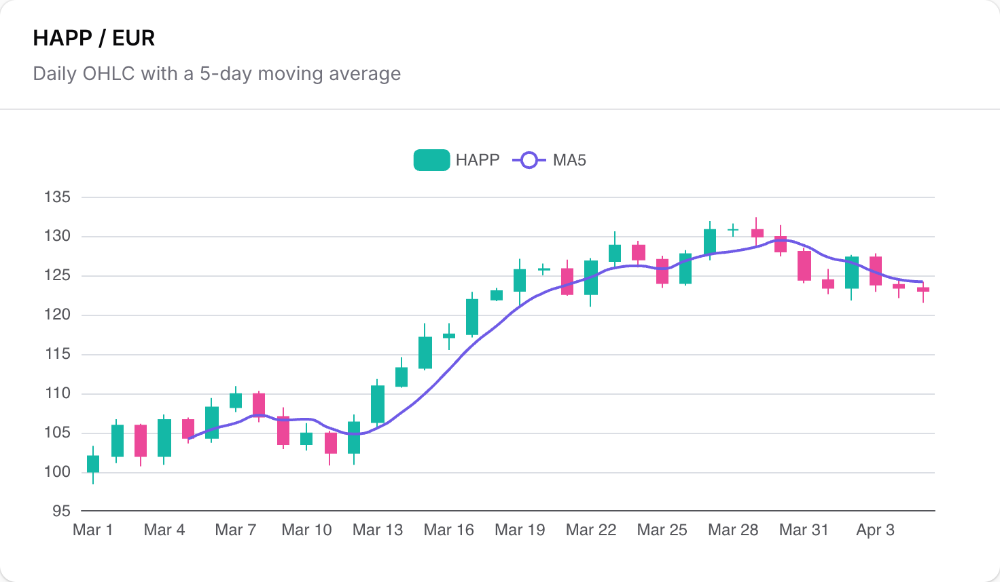 | 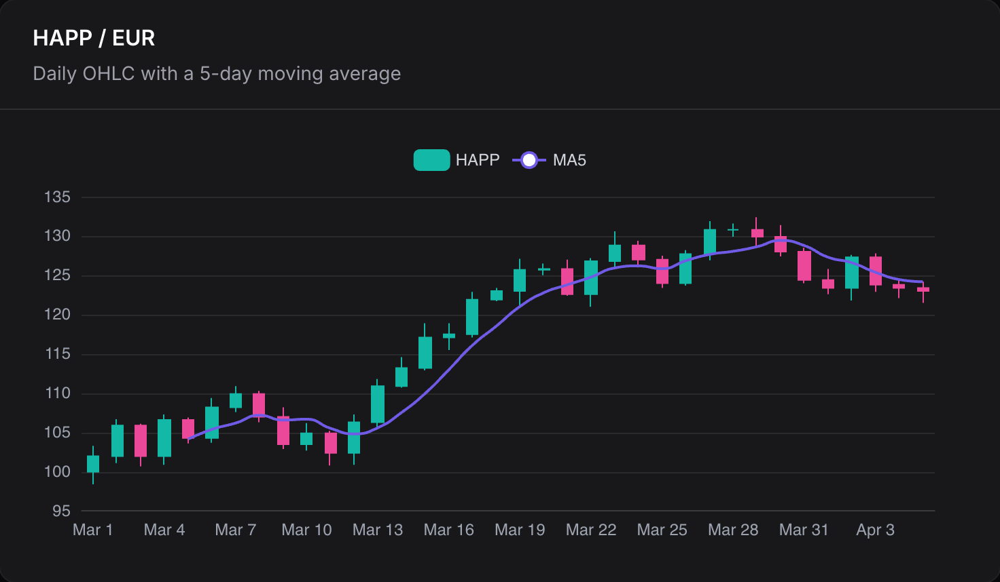 |

<details>
<summary>Widget code</summary>

```php
use Carbon\CarbonImmutable;
use Happenv\FilamentEnhancedCharts\Option\Axis\CategoryAxis;
use Happenv\FilamentEnhancedCharts\Option\Axis\ValueAxis;
use Happenv\FilamentEnhancedCharts\Option\Option;
use Happenv\FilamentEnhancedCharts\Option\Series\CandlestickSeries;
use Happenv\FilamentEnhancedCharts\Option\Series\LineSeries;
use Happenv\FilamentEnhancedCharts\Option\Style\ItemStyle;
use Happenv\FilamentEnhancedCharts\Widgets\EnhancedChartWidget;

class CandlestickChart extends EnhancedChartWidget
{
    protected static ?string $heading = 'HAPP / EUR';

    protected static ?string $subheading = 'Daily OHLC with a 5-day moving average';

    protected ?string $pollingInterval = null;

    protected function getOption(): Option
    {
        [$days, $ohlc, $ma] = $this->prices();

        return Option::cartesian()
            ->xAxis(CategoryAxis::make()->data($days))
            ->yAxis(ValueAxis::make()->scale())
            ->series(
                CandlestickSeries::make()
                    ->name('HAPP')
                    ->itemStyle(ItemStyle::make()->color('#14b8a6')->raw(['color0' => '#ec4899', 'borderColor' => '#14b8a6', 'borderColor0' => '#ec4899']))
                    ->data($ohlc),
                LineSeries::make()->name('MA5')->smooth()->showSymbol(false)->color('#6f5be6')->data($ma),
            );
    }

    /** @return array{list<string>, list<array{float, float, float, float}>, list<float|string>} */
    private function prices(): array
    {
        mt_srand(42);
        $price = 100.0;
        $days = $ohlc = $closes = $ma = [];

        foreach (range(1, 36) as $d) {
            $open = $price;
            $close = round($open + mt_rand(-40, 46) / 10, 2);
            $ohlc[] = [$open, $close, round(min($open, $close) - mt_rand(2, 18) / 10, 2), round(max($open, $close) + mt_rand(2, 18) / 10, 2)];
            $days[] = CarbonImmutable::parse('2026-03-01')->addDays($d - 1)->format('M j');
            $closes[] = $close;
            $ma[] = count($closes) >= 5 ? round(array_sum(array_slice($closes, -5)) / 5, 2) : '-';
            $price = $close;
        }

        return [$days, $ohlc, $ma];
    }
}
```

</details>

### With a data-zoom slider

_HAPP / EUR — zoomable — Same chart plus a data-zoom slider_

| Light | Dark |
|:---:|:---:|
| 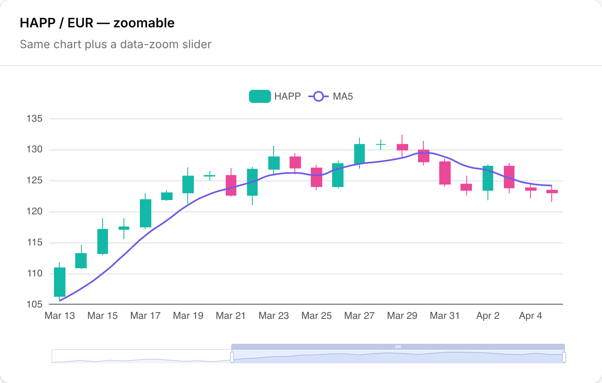 | 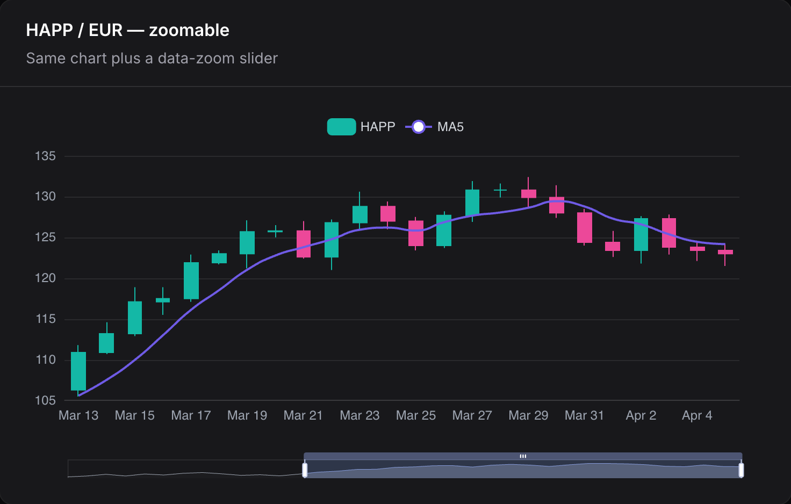 |

<details>
<summary>Widget code</summary>

```php
use App\Filament\Gallery\Widgets\CandlestickChart;
use Happenv\FilamentEnhancedCharts\Option\Component\DataZoom;
use Happenv\FilamentEnhancedCharts\Option\Option;

class CandlestickZoomChart extends CandlestickChart
{
    protected static ?string $heading = 'HAPP / EUR — zoomable';

    protected static ?string $subheading = 'Same chart plus a data-zoom slider';

    protected static int $contentHeight = 340;

    protected function getOption(): Option
    {
        return parent::getOption()->dataZoom(
            DataZoom::inside()->start(35)->end(100),
            DataZoom::slider()->start(35)->end(100)->height(20)->bottom(4),
        );
    }
}
```

</details>

[↑ Contents](#contents)

## Boxplot

`BoxplotSeries` — Min, quartiles and max of a distribution per category.

### Distribution per category

_Response times — Distribution per endpoint, ms_

| Light | Dark |
|:---:|:---:|
| 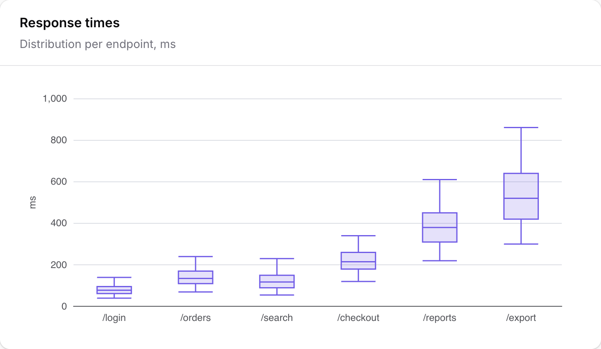 | 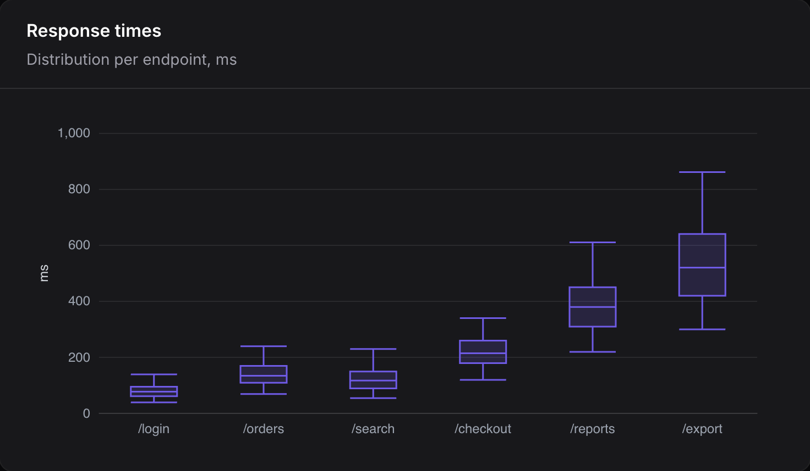 |

<details>
<summary>Widget code</summary>

```php
use Happenv\FilamentEnhancedCharts\Option\Axis\CategoryAxis;
use Happenv\FilamentEnhancedCharts\Option\Axis\ValueAxis;
use Happenv\FilamentEnhancedCharts\Option\Component\Tooltip;
use Happenv\FilamentEnhancedCharts\Option\Option;
use Happenv\FilamentEnhancedCharts\Option\Series\BoxplotSeries;
use Happenv\FilamentEnhancedCharts\Option\Style\ItemStyle;
use Happenv\FilamentEnhancedCharts\Widgets\EnhancedChartWidget;

class BoxplotChart extends EnhancedChartWidget
{
    protected static ?string $heading = 'Response times';

    protected static ?string $subheading = 'Distribution per endpoint, ms';

    protected ?string $pollingInterval = null;

    protected function getOption(): Option
    {
        return Option::make()
            ->tooltip(Tooltip::make()->trigger('item'))
            ->xAxis(CategoryAxis::make()->data(['/login', '/orders', '/search', '/checkout', '/reports', '/export']))
            ->yAxis(ValueAxis::make()->name('ms'))
            ->series(
                BoxplotSeries::make()
                    ->boxWidth([18, 42])
                    ->itemStyle(ItemStyle::make()->color('rgba(111, 91, 230, 0.18)')->borderColor('#6f5be6')->borderWidth(1.5))
                    ->data([
                        [40, 62, 78, 96, 140],
                        [70, 110, 135, 170, 240],
                        [55, 90, 118, 150, 230],
                        [120, 180, 215, 260, 340],
                        [220, 310, 380, 450, 610],
                        [300, 420, 520, 640, 860],
                    ]),
            );
    }
}
```

</details>

[↑ Contents](#contents)

## Heatmap

`HeatmapSeries` — Values as colour on a cartesian grid or a calendar.

### Cartesian heatmap

_Busy hours — Cartesian heatmap with a piecewise visual map_

| Light | Dark |
|:---:|:---:|
| 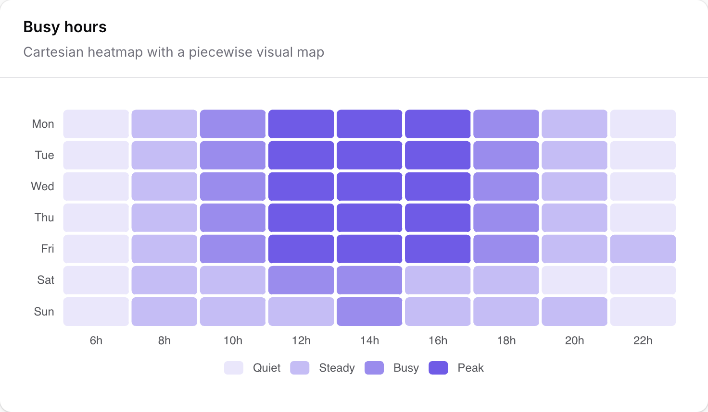 | 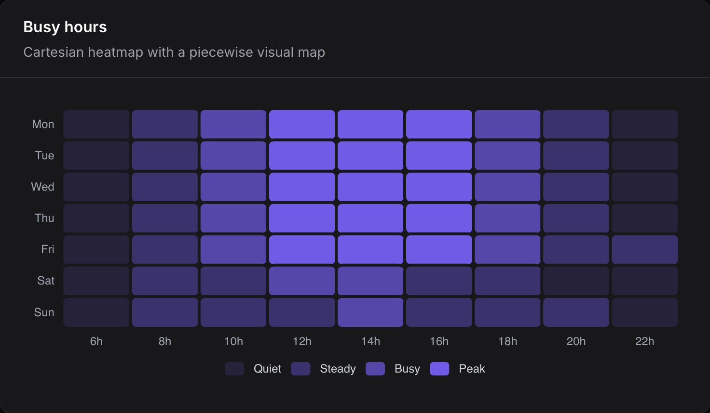 |

<details>
<summary>Widget code</summary>

```php
use Happenv\FilamentEnhancedCharts\Option\Axis\CategoryAxis;
use Happenv\FilamentEnhancedCharts\Option\Component\Grid;
use Happenv\FilamentEnhancedCharts\Option\Component\Tooltip;
use Happenv\FilamentEnhancedCharts\Option\Component\VisualMap;
use Happenv\FilamentEnhancedCharts\Option\Option;
use Happenv\FilamentEnhancedCharts\Option\Series\HeatmapSeries;
use Happenv\FilamentEnhancedCharts\Option\Style\ItemStyle;
use Happenv\FilamentEnhancedCharts\Widgets\EnhancedChartWidget;

class HeatmapCartesianChart extends EnhancedChartWidget
{
    protected static ?string $heading = 'Busy hours';

    protected static ?string $subheading = 'Cartesian heatmap with a piecewise visual map';

    protected ?string $pollingInterval = null;

    protected function getOption(): Option
    {
        $days = ['Mon', 'Tue', 'Wed', 'Thu', 'Fri', 'Sat', 'Sun'];
        $hours = array_map(fn (int $h): string => "{$h}h", range(6, 22, 2));
        $cells = [];

        foreach ($hours as $x => $_) {
            foreach ($days as $y => $__) {
                $peak = exp(-(($x - 4) ** 2) / 6) * ($y < 5 ? 1 : 0.45);
                $cells[] = [$x, $y, (int) round(10 + 90 * $peak + (($x * 7 + $y * 13) % 11))];
            }
        }

        return Option::make()
            ->tooltip(Tooltip::make()->trigger('item'))
            ->grid(Grid::make()->left(8)->right(8)->top(8)->bottom(44))
            ->xAxis(CategoryAxis::make()->data($hours)->splitArea(false)->axisLine(false)->axisTick(false))
            ->yAxis(CategoryAxis::make()->inverse()->data($days)->axisLine(false)->axisTick(false))
            ->visualMap(
                VisualMap::piecewise()
                    ->orient('horizontal')
                    ->left('center')
                    ->bottom(0)
                    ->pieces([['min' => 80, 'label' => 'Peak'], ['min' => 50, 'max' => 80, 'label' => 'Busy'], ['min' => 25, 'max' => 50, 'label' => 'Steady'], ['max' => 25, 'label' => 'Quiet']])
                    ->inRange(['color' => ['rgba(111, 91, 230, 0.15)', 'rgba(111, 91, 230, 0.4)', 'rgba(111, 91, 230, 0.7)', '#6f5be6']]),
            )
            ->series(
                HeatmapSeries::make()
                    ->itemStyle(ItemStyle::make()->borderWidth(3)->borderRadius(6))
                    ->data($cells),
            );
    }
}
```

</details>

### Calendar heatmap

_Orders in 2026 — Daily orders, one cell per day_

| Light | Dark |
|:---:|:---:|
| 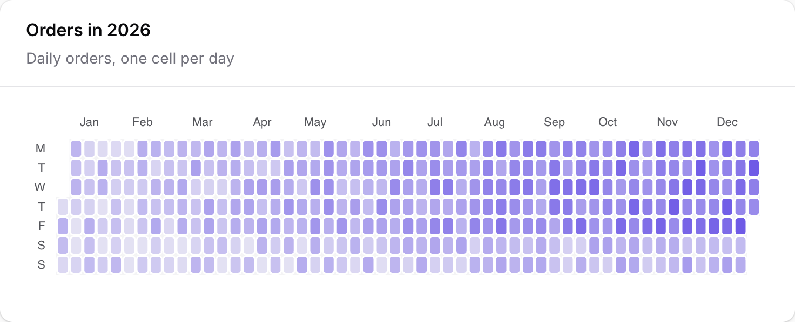 | 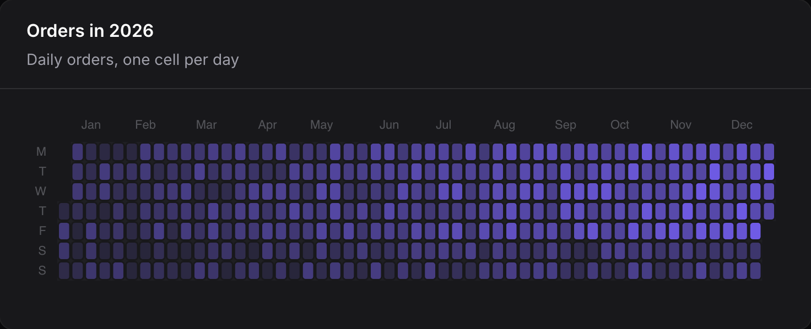 |

<details>
<summary>Widget code</summary>

```php
use Carbon\CarbonImmutable;
use Happenv\FilamentEnhancedCharts\Option\Component\Calendar;
use Happenv\FilamentEnhancedCharts\Option\Component\Tooltip;
use Happenv\FilamentEnhancedCharts\Option\Component\VisualMap;
use Happenv\FilamentEnhancedCharts\Option\Option;
use Happenv\FilamentEnhancedCharts\Option\Series\HeatmapSeries;
use Happenv\FilamentEnhancedCharts\Option\Style\ItemStyle;
use Happenv\FilamentEnhancedCharts\Widgets\EnhancedChartWidget;

class OrdersCalendarChart extends EnhancedChartWidget
{
    protected static ?string $heading = 'Orders in 2026';

    protected static ?string $subheading = 'Daily orders, one cell per day';

    protected static int $contentHeight = 170;

    protected ?string $pollingInterval = null;

    protected int | string | array $columnSpan = 2;

    protected function getOption(): Option
    {
        return Option::make()
            ->tooltip(Tooltip::make()->trigger('item')->formatter('{c0}'))
            ->visualMap(
                VisualMap::continuous()
                    ->min(0)
                    ->max(60)
                    ->show(false)
                    ->inRange(['color' => ['rgba(111, 91, 230, 0.12)', 'rgba(111, 91, 230, 0.55)', 'rgba(111, 91, 230, 1)']]),
            )
            ->calendar(
                Calendar::make()
                    ->range('2026')
                    ->cellSize(['auto', 18])
                    ->left(28)->right(8)->top(24)
                    ->dayLabel(['firstDay' => 1, 'nameMap' => ['S', 'M', 'T', 'W', 'T', 'F', 'S'], 'fontSize' => 11])
                    ->monthLabel(['fontSize' => 11])
                    ->yearLabel(['show' => false])
                    ->splitLine(false)
                    ->itemStyle(ItemStyle::make()->color('rgba(113, 113, 122, 0.08)')->borderWidth(1.5)->borderColor('rgba(0, 0, 0, 0)')),
            )
            ->series(
                HeatmapSeries::make()
                    ->coordinateSystem('calendar')
                    ->itemStyle(ItemStyle::make()->borderRadius(3)->borderWidth(1.5)->borderColor('rgba(0, 0, 0, 0)'))
                    ->data($this->dailyOrders()),
            );
    }

    /** @return list<array{string, int}> */
    private function dailyOrders(): array
    {
        mt_srand(2026);

        $rows = [];
        $day = CarbonImmutable::parse('2026-01-01');

        while ($day->year === 2026) {
            $trend = 8 + $day->dayOfYear / 9;
            $weekday = $day->isWeekend() ? 0.45 : 1.0;
            $rows[] = [$day->toDateString(), (int) round(max(0, $trend * $weekday + mt_rand(-10, 14)))];
            $day = $day->addDay();
        }

        return $rows;
    }
}
```

</details>

[↑ Contents](#contents)

## Radar

`RadarSeries` — Several metrics per item on radial axes.

### Circle radar

_Plan scorecard — Customer ratings per area_

| Light | Dark |
|:---:|:---:|
| 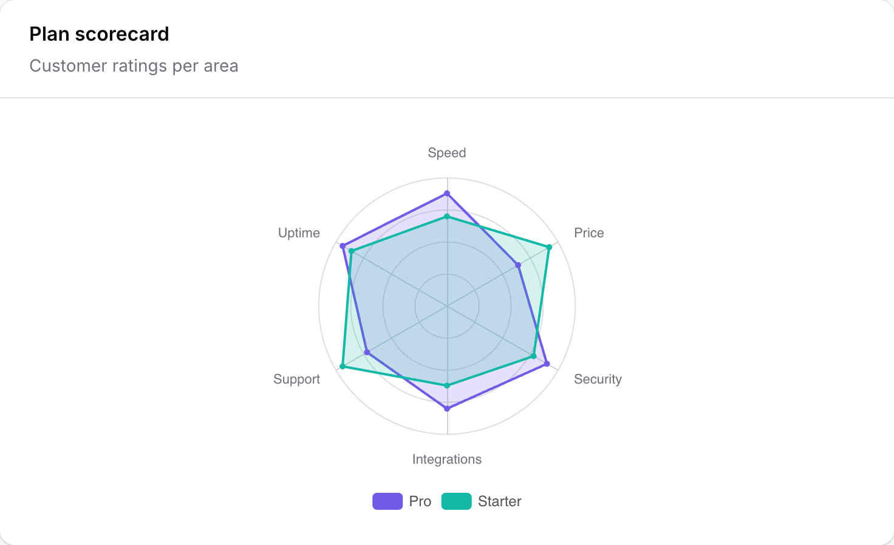 | 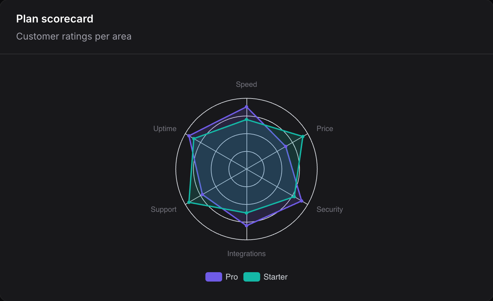 |

<details>
<summary>Widget code</summary>

```php
use Happenv\FilamentEnhancedCharts\Option\Component\Legend;
use Happenv\FilamentEnhancedCharts\Option\Component\Radar;
use Happenv\FilamentEnhancedCharts\Option\Option;
use Happenv\FilamentEnhancedCharts\Option\Series\RadarSeries;
use Happenv\FilamentEnhancedCharts\Option\Style\AreaStyle;
use Happenv\FilamentEnhancedCharts\Widgets\EnhancedChartWidget;

class PlanScoreChart extends EnhancedChartWidget
{
    protected static ?string $heading = 'Plan scorecard';

    protected static ?string $subheading = 'Customer ratings per area';

    protected static int $contentHeight = 320;

    protected ?string $pollingInterval = null;

    protected function getOption(): Option
    {
        return Option::make()
            ->color('#6f5be6', '#14b8a6')
            ->legend(Legend::make()->bottom(0))
            ->radar(
                Radar::make()
                    ->shape('circle')
                    ->radius('66%')
                    ->center(['50%', '46%'])
                    ->splitNumber(4)
                    ->axisName(['fontSize' => 11, 'color' => '#71717a'])
                    ->splitArea(false)
                    ->indicator([
                        ['name' => 'Speed', 'max' => 100],
                        ['name' => 'Uptime', 'max' => 100],
                        ['name' => 'Support', 'max' => 100],
                        ['name' => 'Integrations', 'max' => 100],
                        ['name' => 'Security', 'max' => 100],
                        ['name' => 'Price', 'max' => 100],
                    ]),
            )
            ->series(
                RadarSeries::make()
                    ->symbol('circle')
                    ->symbolSize(5)
                    ->areaStyle(AreaStyle::make()->opacity(0.18))
                    ->data([
                        ['name' => 'Pro', 'value' => [88, 94, 72, 80, 90, 64]],
                        ['name' => 'Starter', 'value' => [70, 86, 94, 62, 78, 92]],
                    ]),
            );
    }
}
```

</details>

### Polygon radar

_Candidate assessment — Polygon radar with split areas and a side legend_

| Light | Dark |
|:---:|:---:|
| 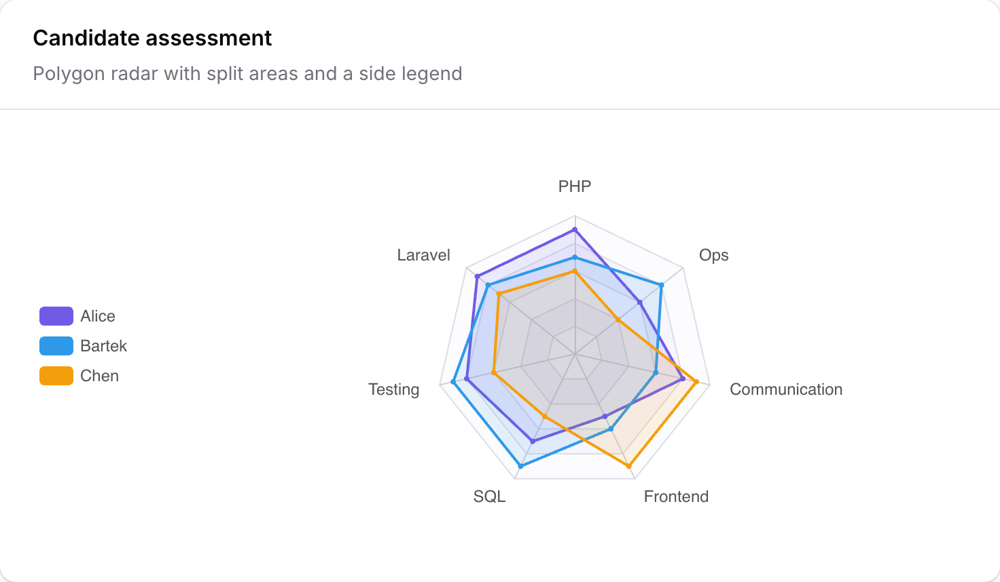 | 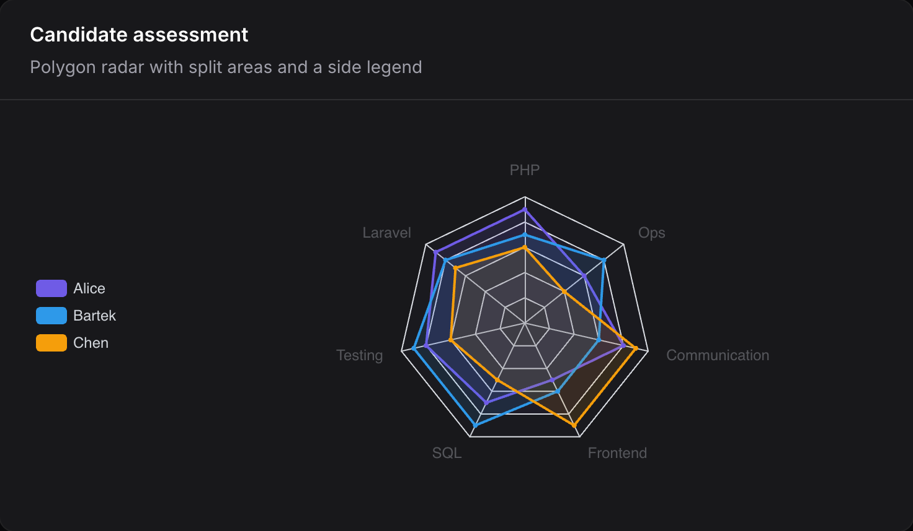 |

<details>
<summary>Widget code</summary>

```php
use Happenv\FilamentEnhancedCharts\Option\Component\Legend;
use Happenv\FilamentEnhancedCharts\Option\Component\Radar;
use Happenv\FilamentEnhancedCharts\Option\Option;
use Happenv\FilamentEnhancedCharts\Option\Series\RadarSeries;
use Happenv\FilamentEnhancedCharts\Option\Style\AreaStyle;
use Happenv\FilamentEnhancedCharts\Widgets\EnhancedChartWidget;

class RadarPolygonChart extends EnhancedChartWidget
{
    protected static ?string $heading = 'Candidate assessment';

    protected static ?string $subheading = 'Polygon radar with split areas and a side legend';

    protected ?string $pollingInterval = null;

    protected function getOption(): Option
    {
        return Option::make()
            ->color('#6f5be6', '#2e99e9', '#f59e0b')
            ->legend(Legend::make()->orient('vertical')->left(0)->top('middle'))
            ->radar(
                Radar::make()
                    ->shape('polygon')
                    ->splitNumber(5)
                    ->radius('68%')
                    ->center(['58%', '52%'])
                    ->splitArea(['areaStyle' => ['color' => ['rgba(111, 91, 230, 0.02)', 'rgba(111, 91, 230, 0.06)']]])
                    ->indicator([
                        ['name' => 'PHP', 'max' => 10], ['name' => 'Laravel', 'max' => 10], ['name' => 'Testing', 'max' => 10],
                        ['name' => 'SQL', 'max' => 10], ['name' => 'Frontend', 'max' => 10], ['name' => 'Communication', 'max' => 10],
                        ['name' => 'Ops', 'max' => 10],
                    ]),
            )
            ->series(
                RadarSeries::make()
                    ->areaStyle(AreaStyle::make()->opacity(0.12))
                    ->symbolSize(4)
                    ->data([
                        ['name' => 'Alice', 'value' => [9, 9, 8, 7, 5, 8, 6]],
                        ['name' => 'Bartek', 'value' => [7, 8, 9, 9, 6, 6, 8]],
                        ['name' => 'Chen', 'value' => [6, 7, 6, 5, 9, 9, 4]],
                    ]),
            );
    }
}
```

</details>

[↑ Contents](#contents)

## Gauge

`GaugeSeries` — A single value against a scale — speedometer or progress rings.

### Speedometer

_API throughput — Classic gauge with colour bands and a pointer_

| Light | Dark |
|:---:|:---:|
| 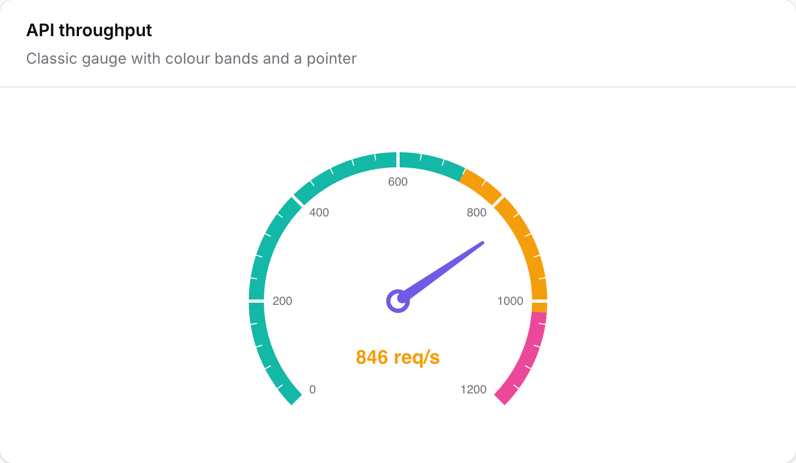 | 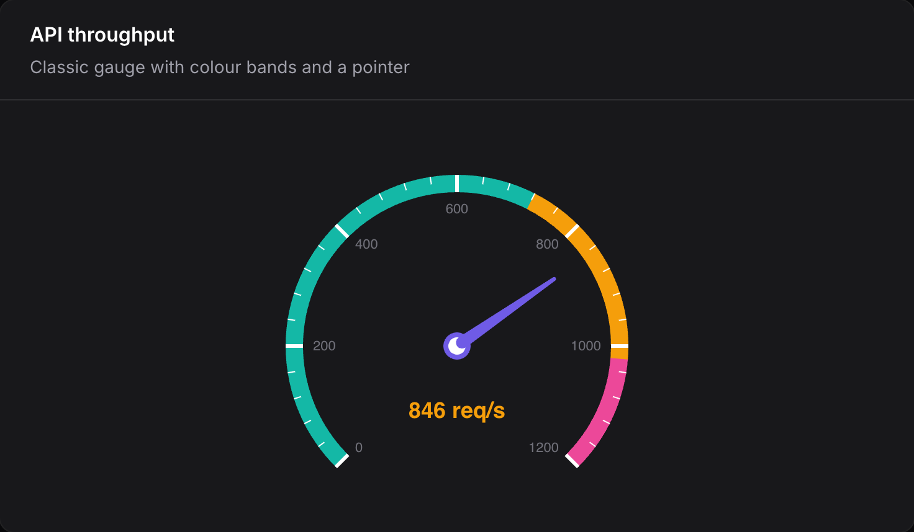 |

<details>
<summary>Widget code</summary>

```php
use Happenv\FilamentEnhancedCharts\Option\DataPoint;
use Happenv\FilamentEnhancedCharts\Option\Option;
use Happenv\FilamentEnhancedCharts\Option\Series\GaugeSeries;
use Happenv\FilamentEnhancedCharts\Widgets\EnhancedChartWidget;

class GaugeSpeedometerChart extends EnhancedChartWidget
{
    protected static ?string $heading = 'API throughput';

    protected static ?string $subheading = 'Classic gauge with colour bands and a pointer';

    protected ?string $pollingInterval = null;

    protected function getOption(): Option
    {
        return Option::make()->series(
            GaugeSeries::make()
                ->min(0)
                ->max(1200)
                ->splitNumber(6)
                ->radius('92%')
                ->raw(['center' => ['50%', '58%']])
                ->axisLine(['lineStyle' => ['width' => 14, 'color' => [[0.6, '#14b8a6'], [0.85, '#f59e0b'], [1, '#ec4899']]]])
                ->pointer(['icon' => 'path://M2090.36389,615.30999 L2090.36389,615.30999 C2091.48372,615.30999 2092.40383,616.194028 2092.44859,617.312956 L2096.90698,728.755929 C2097.05155,732.369577 2094.2393,735.416212 2090.62566,735.56078 C2090.53845,735.564269 2090.45117,735.566014 2090.36389,735.566014 L2090.36389,735.566014 C2086.74736,735.566014 2083.81557,732.63423 2083.81557,729.017692 C2083.81557,728.930412 2083.81732,728.84314 2083.82081,728.755929 L2088.2792,617.312956 C2088.32396,616.194028 2089.24407,615.30999 2090.36389,615.30999 Z', 'length' => '70%', 'width' => 10, 'itemStyle' => ['color' => '#6f5be6']])
                ->anchor(['show' => true, 'size' => 18, 'itemStyle' => ['borderWidth' => 4, 'borderColor' => '#6f5be6']])
                ->axisTick(['distance' => -14, 'length' => 6, 'lineStyle' => ['color' => '#fff', 'width' => 1]])
                ->splitLine(['distance' => -14, 'length' => 14, 'lineStyle' => ['color' => '#fff', 'width' => 3]])
                ->axisLabel(['distance' => 22, 'fontSize' => 11, 'color' => '#71717a'])
                ->detail(['valueAnimation' => true, 'formatter' => '{value} req/s', 'fontSize' => 18, 'fontWeight' => 600, 'offsetCenter' => [0, '38%'], 'color' => 'inherit'])
                ->data([DataPoint::make(846)]),
        );
    }
}
```

</details>

### Progress rings

_Cluster health — Live usage across 12 nodes_

| Light | Dark |
|:---:|:---:|
| 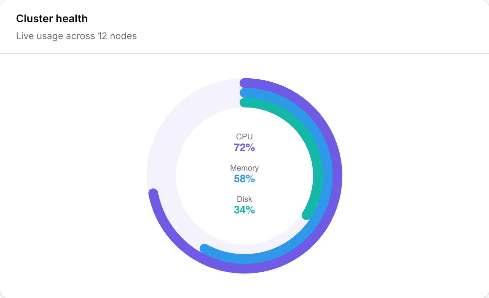 | 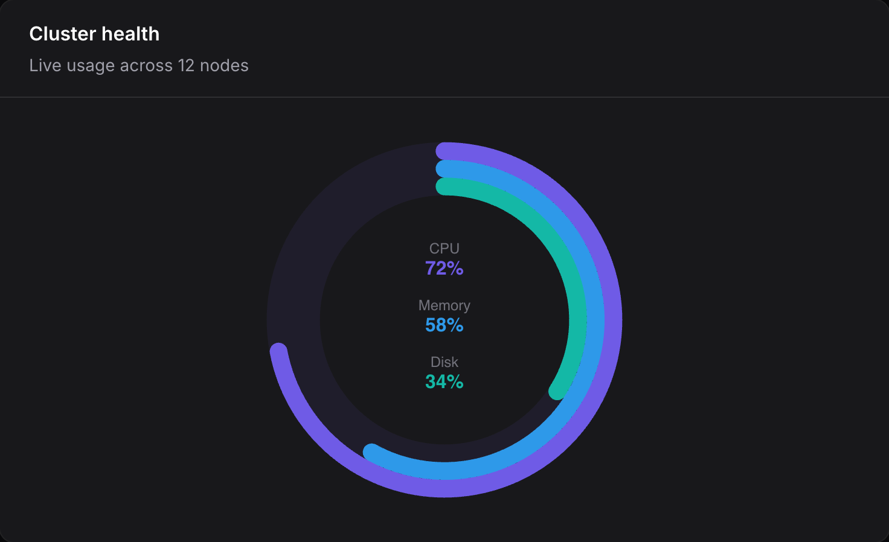 |

<details>
<summary>Widget code</summary>

```php
use Happenv\FilamentEnhancedCharts\Option\DataPoint;
use Happenv\FilamentEnhancedCharts\Option\Option;
use Happenv\FilamentEnhancedCharts\Option\Series\GaugeSeries;
use Happenv\FilamentEnhancedCharts\Widgets\EnhancedChartWidget;

class ClusterHealthChart extends EnhancedChartWidget
{
    protected static ?string $heading = 'Cluster health';

    protected static ?string $subheading = 'Live usage across 12 nodes';

    protected static int $contentHeight = 320;

    protected ?string $pollingInterval = null;

    protected function getOption(): Option
    {
        $ring = fn (int | float $value, string $name, string $color, string $y): DataPoint => DataPoint::make($value)
            ->name($name)
            ->itemStyle(['color' => $color])
            ->title(['offsetCenter' => ['0%', $y]])
            ->detail(['offsetCenter' => ['0%', ((int) $y + 11) . '%']]);

        return Option::make()->series(
            GaugeSeries::make()
                ->startAngle(90)
                ->endAngle(-270)
                ->radius('92%')
                ->pointer(false)
                ->progress(['show' => true, 'overlap' => false, 'roundCap' => true, 'clip' => false])
                ->axisLine(['lineStyle' => ['width' => 44, 'color' => [[1, 'rgba(111, 91, 230, 0.08)']]]])
                ->splitLine(false)
                ->axisTick(false)
                ->axisLabel(['show' => false])
                ->title(['fontSize' => 12, 'color' => '#71717a'])
                ->detail(['width' => 40, 'height' => 14, 'fontSize' => 16, 'fontWeight' => 600, 'color' => 'inherit', 'formatter' => '{value}%'])
                ->data([
                    $ring(72, 'CPU', '#6f5be6', '-40%'),
                    $ring(58, 'Memory', '#2e99e9', '-8%'),
                    $ring(34, 'Disk', '#14b8a6', '24%'),
                ]),
        );
    }
}
```

</details>

[↑ Contents](#contents)

## Funnel

`FunnelSeries` — Drop-off between steps; sorted ascending it becomes a pyramid.

### Checkout funnel

_Checkout funnel — Visitors reaching each step, last 30 days_

| Light | Dark |
|:---:|:---:|
| 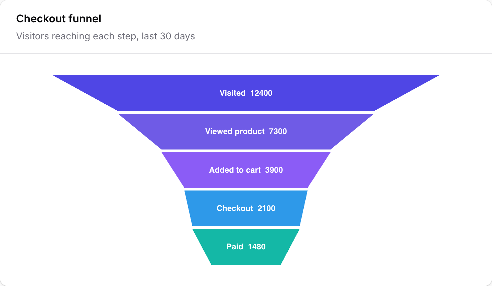 | 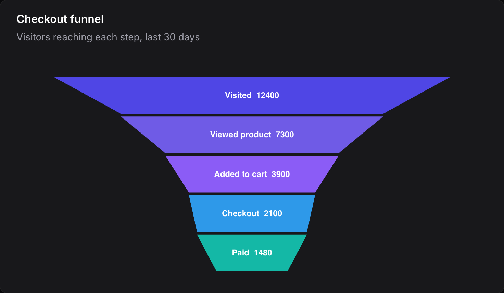 |

<details>
<summary>Widget code</summary>

```php
use Happenv\FilamentEnhancedCharts\Option\Component\Tooltip;
use Happenv\FilamentEnhancedCharts\Option\DataPoint;
use Happenv\FilamentEnhancedCharts\Option\Option;
use Happenv\FilamentEnhancedCharts\Option\Series\FunnelSeries;
use Happenv\FilamentEnhancedCharts\Option\Style\ItemStyle;
use Happenv\FilamentEnhancedCharts\Option\Style\Label;
use Happenv\FilamentEnhancedCharts\Widgets\EnhancedChartWidget;

class FunnelChart extends EnhancedChartWidget
{
    protected static ?string $heading = 'Checkout funnel';

    protected static ?string $subheading = 'Visitors reaching each step, last 30 days';

    protected ?string $pollingInterval = null;

    protected function getOption(): Option
    {
        return Option::make()
            ->color('#4f46e5', '#6f5be6', '#8b5cf6', '#2e99e9', '#14b8a6')
            ->tooltip(Tooltip::make()->trigger('item')->formatter('{b}: {c}'))
            ->series(
                FunnelSeries::make()
                    ->sort('descending')
                    ->gap(4)
                    ->left('8%')->right('8%')->top(8)->bottom(8)
                    ->minSize('18%')
                    ->itemStyle(ItemStyle::make()->borderWidth(0)->borderRadius(6))
                    ->label(Label::make()->position('inside')->formatter('{b}  {c}')->color('#ffffff')->fontWeight(600))
                    ->data([
                        DataPoint::make(12400)->name('Visited'),
                        DataPoint::make(7300)->name('Viewed product'),
                        DataPoint::make(3900)->name('Added to cart'),
                        DataPoint::make(2100)->name('Checkout'),
                        DataPoint::make(1480)->name('Paid'),
                    ]),
            );
    }
}
```

</details>

### Pyramid

_Customer tiers — Ascending sort turns the funnel into a pyramid_

| Light | Dark |
|:---:|:---:|
| 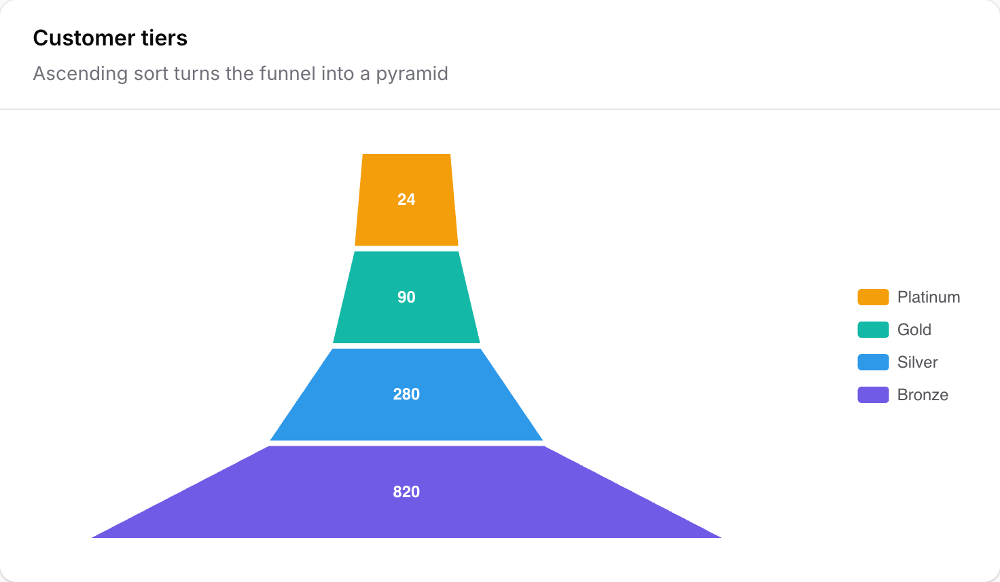 | 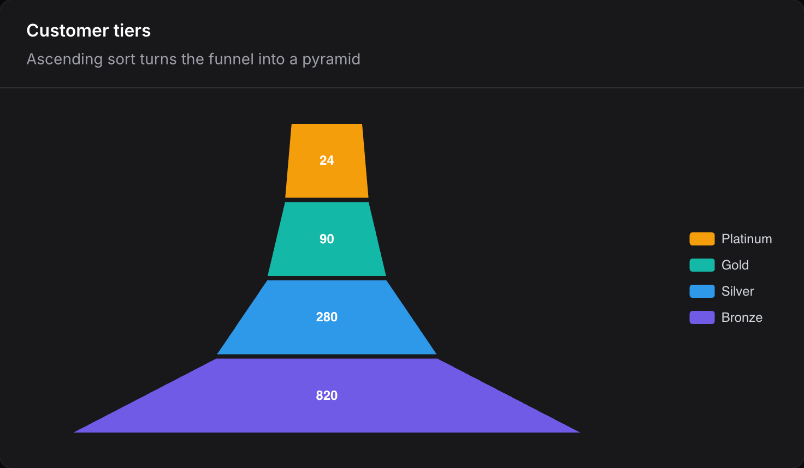 |

<details>
<summary>Widget code</summary>

```php
use Happenv\FilamentEnhancedCharts\Option\Component\Legend;
use Happenv\FilamentEnhancedCharts\Option\DataPoint;
use Happenv\FilamentEnhancedCharts\Option\Option;
use Happenv\FilamentEnhancedCharts\Option\Series\FunnelSeries;
use Happenv\FilamentEnhancedCharts\Option\Style\Label;
use Happenv\FilamentEnhancedCharts\Widgets\EnhancedChartWidget;

class FunnelPyramidChart extends EnhancedChartWidget
{
    protected static ?string $heading = 'Customer tiers';

    protected static ?string $subheading = 'Ascending sort turns the funnel into a pyramid';

    protected ?string $pollingInterval = null;

    protected function getOption(): Option
    {
        return Option::make()
            ->color('#f59e0b', '#14b8a6', '#2e99e9', '#6f5be6')
            ->legend(Legend::make()->orient('vertical')->right(0)->top('middle'))
            ->series(
                FunnelSeries::make()
                    ->sort('ascending')
                    ->gap(3)
                    ->minSize('14%')
                    ->left('6%')->right('26%')->top(8)->bottom(8)
                    ->label(Label::make()->position('inside')->formatter('{c}')->color('#ffffff')->fontWeight(600))
                    ->data([
                        DataPoint::make(24)->name('Platinum'),
                        DataPoint::make(90)->name('Gold'),
                        DataPoint::make(280)->name('Silver'),
                        DataPoint::make(820)->name('Bronze'),
                    ]),
            );
    }
}
```

</details>

[↑ Contents](#contents)

## Sankey

`SankeySeries` — Flows between stages, horizontal or vertical.

### Horizontal sankey

_Revenue flow — Traffic source → plan → billing cycle_

| Light | Dark |
|:---:|:---:|
| 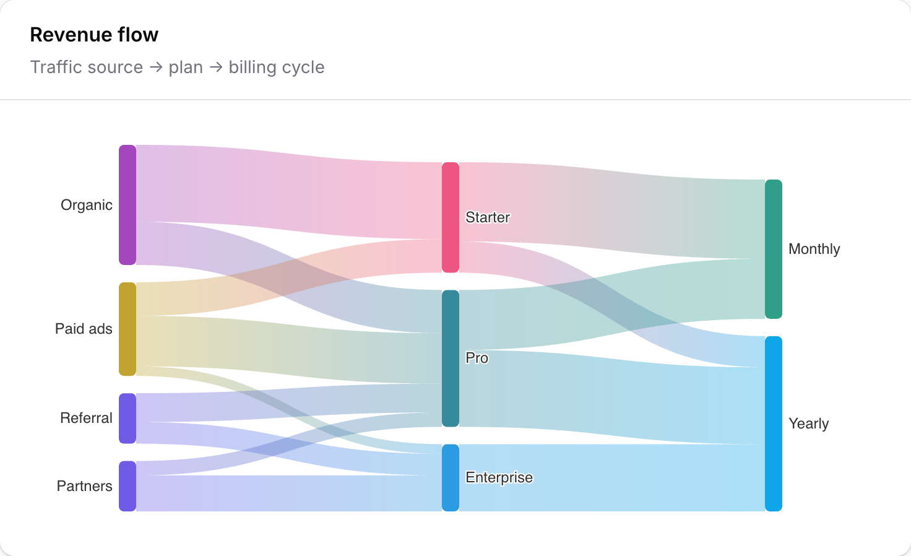 | 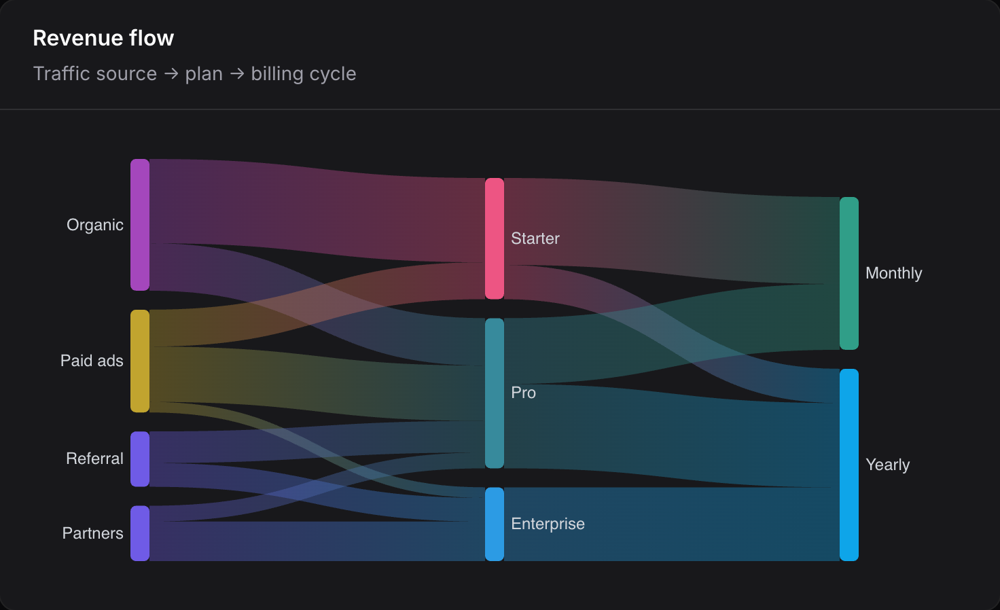 |

<details>
<summary>Widget code</summary>

```php
use Happenv\FilamentEnhancedCharts\Enums\NodeAlign;
use Happenv\FilamentEnhancedCharts\Option\Component\Tooltip;
use Happenv\FilamentEnhancedCharts\Option\Option;
use Happenv\FilamentEnhancedCharts\Option\Series\SankeySeries;
use Happenv\FilamentEnhancedCharts\Option\Style\Emphasis;
use Happenv\FilamentEnhancedCharts\Option\Style\ItemStyle;
use Happenv\FilamentEnhancedCharts\Option\Style\Label;
use Happenv\FilamentEnhancedCharts\Option\Style\LineStyle;
use Happenv\FilamentEnhancedCharts\Widgets\EnhancedChartWidget;

class RevenueFlowChart extends EnhancedChartWidget
{
    protected static ?string $heading = 'Revenue flow';

    protected static ?string $subheading = 'Traffic source → plan → billing cycle';

    protected static int $contentHeight = 320;

    protected ?string $pollingInterval = null;

    protected int | string | array $columnSpan = 2;

    protected function getOption(): Option
    {
        return Option::make()
            ->color('#6f5be6', '#2e99e9', '#14b8a6', '#f59e0b', '#ec4899', '#4f46e5', '#22c55e', '#8b5cf6', '#0ea5e9')
            ->tooltip(Tooltip::make()->trigger('item'))
            ->series(
                SankeySeries::make()
                    ->nodeAlign(NodeAlign::Justify)
                    ->nodeWidth(14)
                    ->nodeGap(14)
                    ->left(72)->right(80)->top(12)->bottom(12)
                    ->itemStyle(ItemStyle::make()->borderRadius(4))
                    ->lineStyle(LineStyle::make()->color('gradient')->opacity(0.35)->curveness(0.5))
                    ->label(Label::make()->fontSize(12))
                    ->emphasis(Emphasis::make()->focus('adjacency'))
                    ->levels([['depth' => 0, 'label' => ['position' => 'left']]])
                    ->links([
                        ['source' => 'Organic', 'target' => 'Starter', 'value' => 320],
                        ['source' => 'Organic', 'target' => 'Pro', 'value' => 180],
                        ['source' => 'Paid ads', 'target' => 'Starter', 'value' => 140],
                        ['source' => 'Paid ads', 'target' => 'Pro', 'value' => 210],
                        ['source' => 'Paid ads', 'target' => 'Enterprise', 'value' => 40],
                        ['source' => 'Referral', 'target' => 'Pro', 'value' => 120],
                        ['source' => 'Referral', 'target' => 'Enterprise', 'value' => 90],
                        ['source' => 'Partners', 'target' => 'Enterprise', 'value' => 150],
                        ['source' => 'Partners', 'target' => 'Pro', 'value' => 60],
                        ['source' => 'Starter', 'target' => 'Monthly', 'value' => 330],
                        ['source' => 'Starter', 'target' => 'Yearly', 'value' => 130],
                        ['source' => 'Pro', 'target' => 'Monthly', 'value' => 250],
                        ['source' => 'Pro', 'target' => 'Yearly', 'value' => 320],
                        ['source' => 'Enterprise', 'target' => 'Yearly', 'value' => 280],
                    ]),
            );
    }
}
```

</details>

### Vertical sankey

_Energy budget — Vertical sankey, kWh per day_

| Light | Dark |
|:---:|:---:|
| 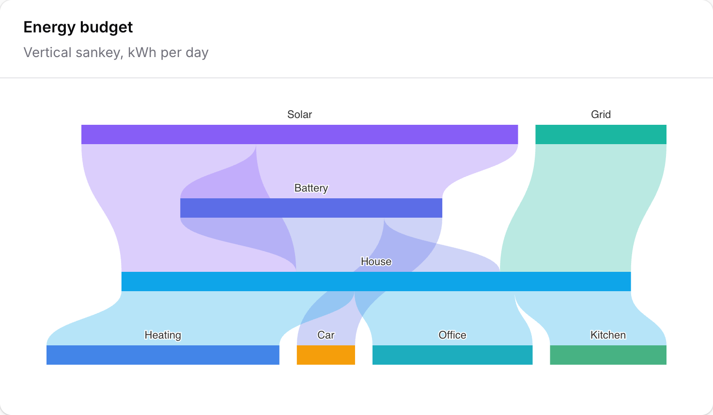 | 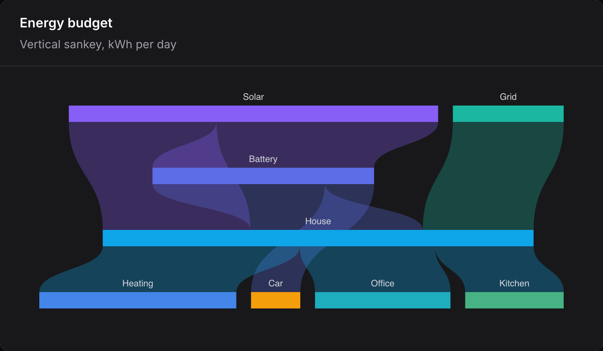 |

<details>
<summary>Widget code</summary>

```php
use Happenv\FilamentEnhancedCharts\Enums\Orient;
use Happenv\FilamentEnhancedCharts\Option\Option;
use Happenv\FilamentEnhancedCharts\Option\Series\SankeySeries;
use Happenv\FilamentEnhancedCharts\Option\Style\Emphasis;
use Happenv\FilamentEnhancedCharts\Option\Style\LineStyle;
use Happenv\FilamentEnhancedCharts\Widgets\EnhancedChartWidget;

class SankeyVerticalChart extends EnhancedChartWidget
{
    protected static ?string $heading = 'Energy budget';

    protected static ?string $subheading = 'Vertical sankey, kWh per day';

    protected ?string $pollingInterval = null;

    protected function getOption(): Option
    {
        return Option::make()
            ->color('#f59e0b', '#14b8a6', '#2e99e9', '#6f5be6', '#ec4899', '#8b5cf6', '#0ea5e9')
            ->series(
                SankeySeries::make()
                    ->orient(Orient::Vertical)
                    ->left(24)->right(24)->top(24)->bottom(28)
                    ->nodeGap(18)
                    ->label(['position' => 'top', 'fontSize' => 11])
                    ->lineStyle(LineStyle::make()->color('source')->opacity(0.3)->curveness(0.5))
                    ->emphasis(Emphasis::make()->focus('adjacency'))
                    ->links([
                        ['source' => 'Solar', 'target' => 'Battery', 'value' => 18],
                        ['source' => 'Solar', 'target' => 'House', 'value' => 12],
                        ['source' => 'Grid', 'target' => 'House', 'value' => 9],
                        ['source' => 'Battery', 'target' => 'House', 'value' => 14],
                        ['source' => 'Battery', 'target' => 'Car', 'value' => 4],
                        ['source' => 'House', 'target' => 'Heating', 'value' => 16],
                        ['source' => 'House', 'target' => 'Kitchen', 'value' => 8],
                        ['source' => 'House', 'target' => 'Office', 'value' => 11],
                    ]),
            );
    }
}
```

</details>

[↑ Contents](#contents)

## Sunburst

`SunburstSeries` — A hierarchy as concentric rings.

### Three-level sunburst

_Sales by region — Region → country → channel_

| Light | Dark |
|:---:|:---:|
| 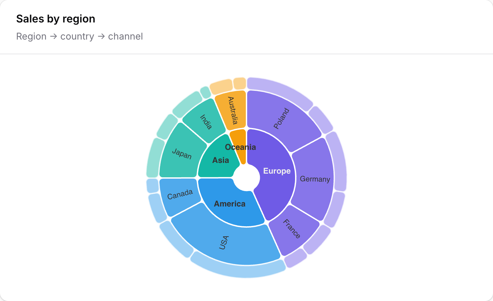 | 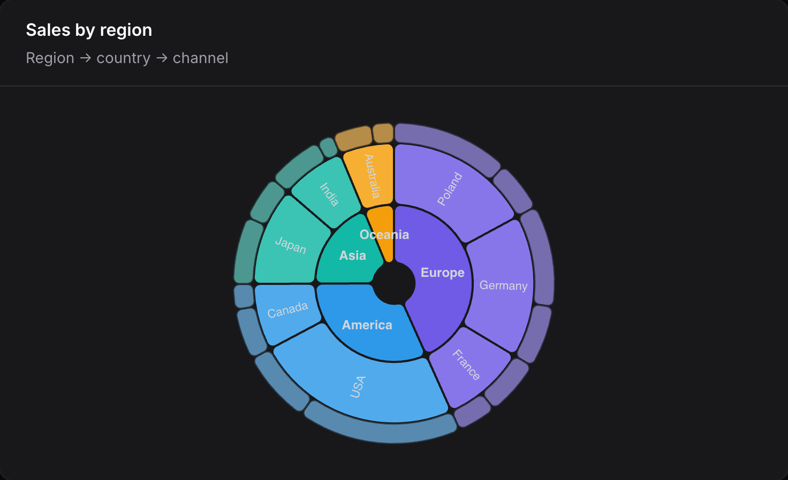 |

<details>
<summary>Widget code</summary>

```php
use Happenv\FilamentEnhancedCharts\Option\Component\Tooltip;
use Happenv\FilamentEnhancedCharts\Option\Option;
use Happenv\FilamentEnhancedCharts\Option\Series\SunburstSeries;
use Happenv\FilamentEnhancedCharts\Option\Style\Emphasis;
use Happenv\FilamentEnhancedCharts\Option\Style\ItemStyle;
use Happenv\FilamentEnhancedCharts\Widgets\EnhancedChartWidget;

class SalesSunburstChart extends EnhancedChartWidget
{
    protected static ?string $heading = 'Sales by region';

    protected static ?string $subheading = 'Region → country → channel';

    protected static int $contentHeight = 320;

    protected ?string $pollingInterval = null;

    protected function getOption(): Option
    {
        $country = fn (string $name, int $web, int $retail): array => [
            'name' => $name,
            'children' => [['name' => 'Web', 'value' => $web], ['name' => 'Retail', 'value' => $retail]],
        ];

        return Option::make()
            ->color('#6f5be6', '#2e99e9', '#14b8a6', '#f59e0b')
            ->tooltip(Tooltip::make()->trigger('item'))
            ->series(
                SunburstSeries::make()
                    ->radius(['12%', '96%'])
                    ->sort(null)
                    ->emphasis(Emphasis::make()->focus('ancestor'))
                    ->itemStyle(ItemStyle::make()->borderRadius(6)->borderWidth(2))
                    ->levels([
                        [],
                        ['r0' => '12%', 'r' => '46%', 'label' => ['rotate' => 0, 'fontSize' => 12, 'fontWeight' => 600]],
                        ['r0' => '46%', 'r' => '82%', 'label' => ['fontSize' => 11]],
                        ['r0' => '82%', 'r' => '94%', 'label' => ['show' => false], 'itemStyle' => ['opacity' => 0.7]],
                    ])
                    ->data([
                        ['name' => 'Europe', 'children' => [$country('Poland', 42, 18), $country('Germany', 36, 22), $country('France', 20, 14)]],
                        ['name' => 'America', 'children' => [$country('USA', 58, 26), $country('Canada', 18, 9)]],
                        ['name' => 'Asia', 'children' => [$country('Japan', 24, 16), $country('India', 20, 6)]],
                        ['name' => 'Oceania', 'children' => [$country('Australia', 14, 8)]],
                    ]),
            );
    }
}
```

</details>

[↑ Contents](#contents)

## Treemap

`TreemapSeries` — A hierarchy as nested rectangles sized by value.

### Two-level treemap

_Storage usage — GB per bucket and folder_

| Light | Dark |
|:---:|:---:|
| 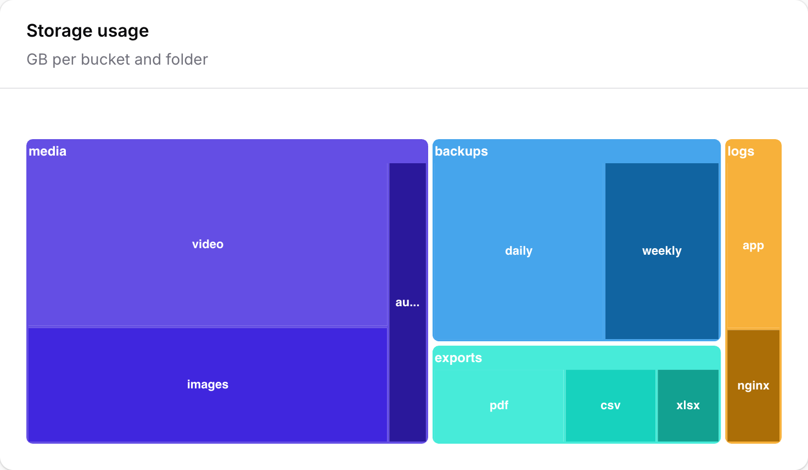 | 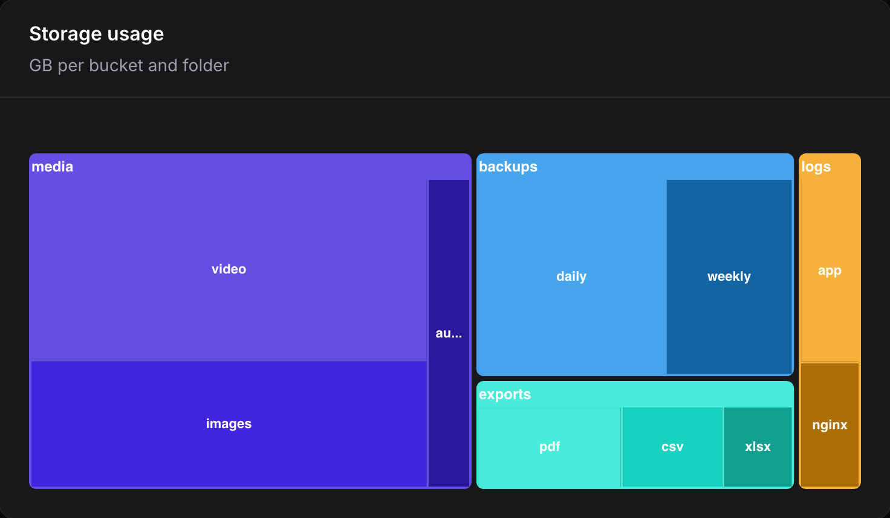 |

<details>
<summary>Widget code</summary>

```php
use Happenv\FilamentEnhancedCharts\Option\Option;
use Happenv\FilamentEnhancedCharts\Option\Series\TreemapSeries;
use Happenv\FilamentEnhancedCharts\Widgets\EnhancedChartWidget;

class TreemapChart extends EnhancedChartWidget
{
    protected static ?string $heading = 'Storage usage';

    protected static ?string $subheading = 'GB per bucket and folder';

    protected ?string $pollingInterval = null;

    protected function getOption(): Option
    {
        $folder = fn (string $name, array $items): array => [
            'name' => $name,
            'children' => array_map(fn (string $k, int $v): array => ['name' => $k, 'value' => $v], array_keys($items), $items),
        ];

        return Option::make()
            ->color('#6f5be6', '#2e99e9', '#14b8a6', '#f59e0b')
            ->series(
                TreemapSeries::make()
                    ->left(0)->right(0)->top(0)->bottom(0)
                    ->roam(false)
                    ->nodeClick(false)
                    ->breadcrumb(false)
                    ->label(['fontSize' => 11, 'fontWeight' => 600])
                    ->upperLabel(['show' => true, 'height' => 22, 'color' => '#ffffff', 'fontWeight' => 600])
                    ->levels([
                        ['itemStyle' => ['gapWidth' => 4, 'borderWidth' => 0]],
                        ['itemStyle' => ['gapWidth' => 2, 'borderColorSaturation' => 0.6, 'borderWidth' => 2, 'borderRadius' => 6], 'colorSaturation' => [0.35, 0.6]],
                    ])
                    ->data([
                        $folder('media', ['images' => 184, 'video' => 262, 'audio' => 48]),
                        $folder('backups', ['daily' => 142, 'weekly' => 96]),
                        $folder('exports', ['csv' => 38, 'pdf' => 54, 'xlsx' => 26]),
                        $folder('logs', ['app' => 44, 'nginx' => 30]),
                    ]),
            );
    }
}
```

</details>

[↑ Contents](#contents)

## Tree

`TreeSeries` — Parent → child structures, horizontal, vertical or radial.

### Horizontal tree

_Organisation — Teams and squads_

| Light | Dark |
|:---:|:---:|
| 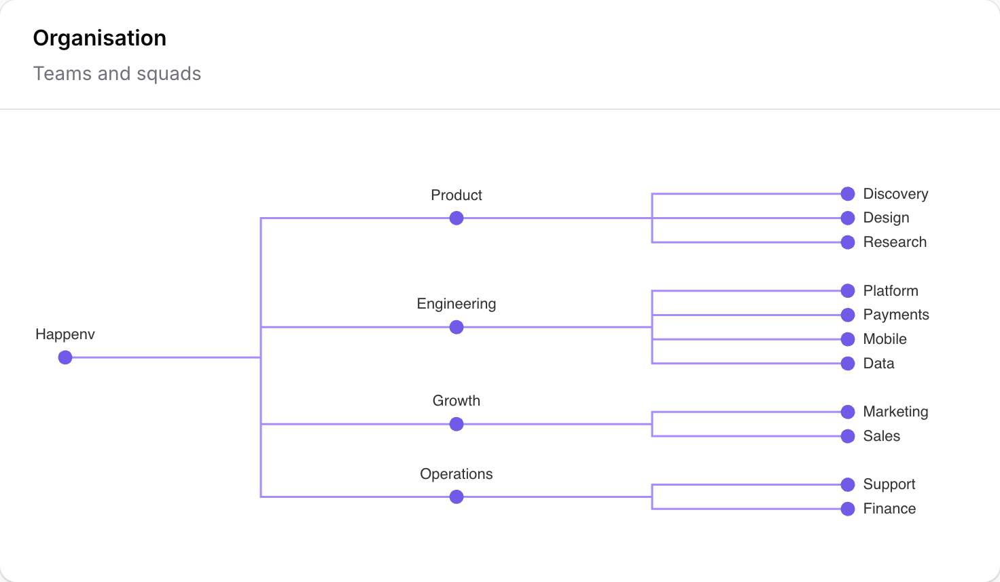 | 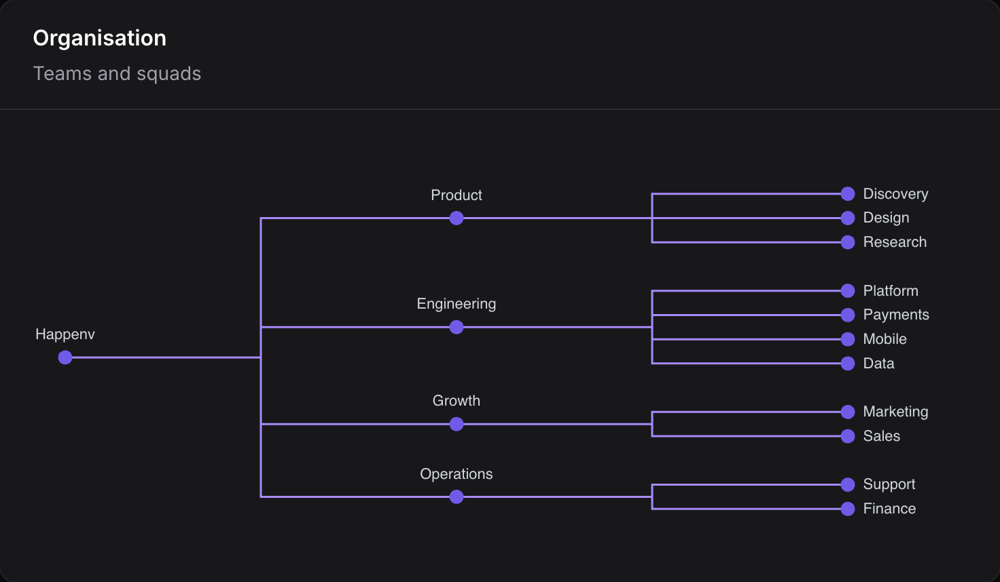 |

<details>
<summary>Widget code</summary>

```php
use Happenv\FilamentEnhancedCharts\Option\Option;
use Happenv\FilamentEnhancedCharts\Option\Series\TreeSeries;
use Happenv\FilamentEnhancedCharts\Option\Style\ItemStyle;
use Happenv\FilamentEnhancedCharts\Option\Style\LineStyle;
use Happenv\FilamentEnhancedCharts\Widgets\EnhancedChartWidget;

class TreeChart extends EnhancedChartWidget
{
    protected static ?string $heading = 'Organisation';

    protected static ?string $subheading = 'Teams and squads';

    protected ?string $pollingInterval = null;

    protected function getOption(): Option
    {
        $team = fn (string $name, array $squads): array => [
            'name' => $name,
            'children' => array_map(fn (string $squad): array => ['name' => $squad], $squads),
        ];

        return Option::make()->series(
            TreeSeries::make()
                ->orient('LR')
                ->edgeShape('polyline')
                ->left(24)->right(88)->top(20)->bottom(12)
                ->symbol('circle')
                ->symbolSize(9)
                ->itemStyle(ItemStyle::make()->color('#6f5be6')->borderColor('#6f5be6'))
                ->lineStyle(LineStyle::make()->color('#a78bfa')->width(1.5))
                ->label(['position' => 'top', 'distance' => 6, 'fontSize' => 11])
                ->leaves(['label' => ['position' => 'right', 'align' => 'left', 'verticalAlign' => 'middle', 'distance' => 6]])
                ->initialTreeDepth(2)
                ->data([[
                    'name' => 'Happenv',
                    'children' => [
                        $team('Product', ['Discovery', 'Design', 'Research']),
                        $team('Engineering', ['Platform', 'Payments', 'Mobile', 'Data']),
                        $team('Growth', ['Marketing', 'Sales']),
                        $team('Operations', ['Support', 'Finance']),
                    ],
                ]]),
        );
    }
}
```

</details>

### Vertical tree

_Navigation — Top-down tree with curved edges_

| Light | Dark |
|:---:|:---:|
| 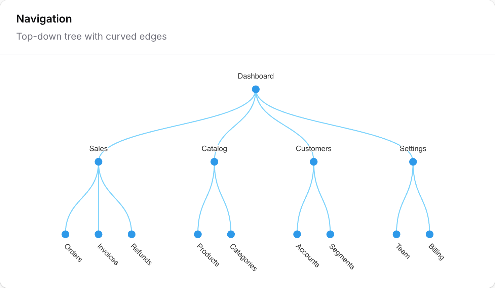 | 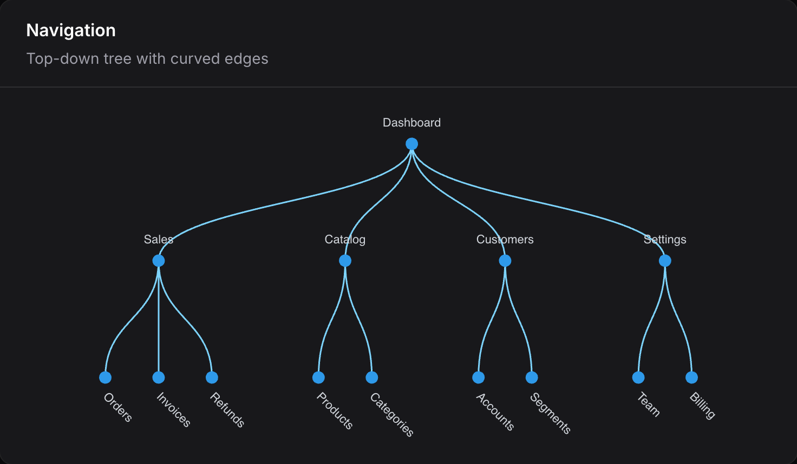 |

<details>
<summary>Widget code</summary>

```php
use Happenv\FilamentEnhancedCharts\Option\Option;
use Happenv\FilamentEnhancedCharts\Option\Series\TreeSeries;
use Happenv\FilamentEnhancedCharts\Option\Style\ItemStyle;
use Happenv\FilamentEnhancedCharts\Option\Style\LineStyle;
use Happenv\FilamentEnhancedCharts\Widgets\EnhancedChartWidget;

class TreeVerticalChart extends EnhancedChartWidget
{
    protected static ?string $heading = 'Navigation';

    protected static ?string $subheading = 'Top-down tree with curved edges';

    protected ?string $pollingInterval = null;

    protected function getOption(): Option
    {
        return Option::make()->series(
            TreeSeries::make()
                ->orient('TB')
                ->left(24)->right(24)->top(28)->bottom(56)
                ->symbol('circle')
                ->symbolSize(10)
                ->itemStyle(ItemStyle::make()->color('#2e99e9')->borderColor('#2e99e9'))
                ->lineStyle(LineStyle::make()->color('#7dd3fc')->width(1.5)->curveness(0.5))
                ->label(['position' => 'top', 'distance' => 8, 'fontSize' => 11])
                ->leaves(['label' => ['position' => 'bottom', 'rotate' => -45, 'align' => 'left', 'verticalAlign' => 'middle', 'distance' => 10]])
                ->data([[
                    'name' => 'Dashboard',
                    'children' => [
                        ['name' => 'Sales', 'children' => [['name' => 'Orders'], ['name' => 'Invoices'], ['name' => 'Refunds']]],
                        ['name' => 'Catalog', 'children' => [['name' => 'Products'], ['name' => 'Categories']]],
                        ['name' => 'Customers', 'children' => [['name' => 'Accounts'], ['name' => 'Segments']]],
                        ['name' => 'Settings', 'children' => [['name' => 'Team'], ['name' => 'Billing']]],
                    ],
                ]]),
        );
    }
}
```

</details>

### Radial tree

_Codebase map — Radial tree layout_

| Light | Dark |
|:---:|:---:|
| 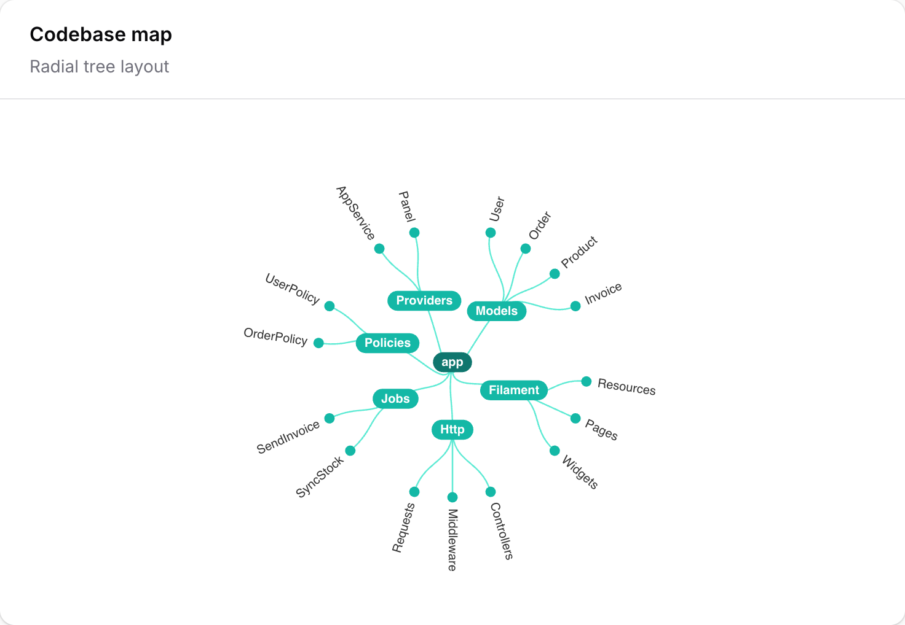 | 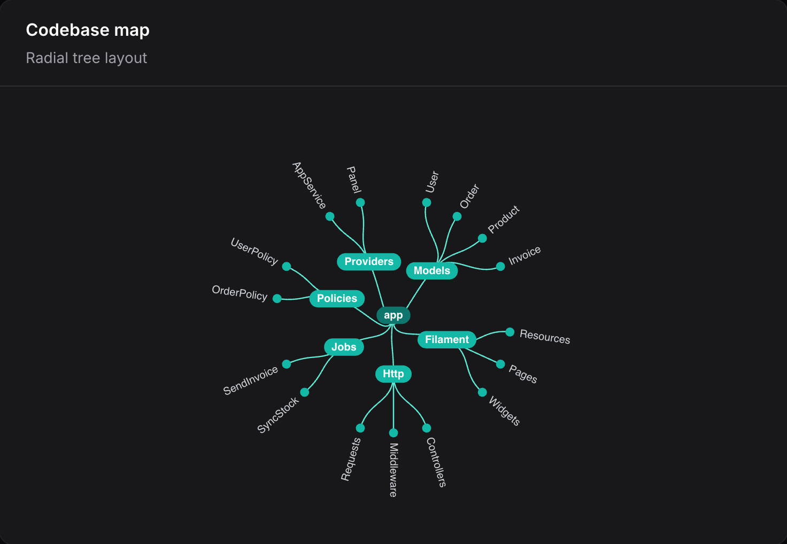 |

<details>
<summary>Widget code</summary>

```php
use Happenv\FilamentEnhancedCharts\Option\Option;
use Happenv\FilamentEnhancedCharts\Option\Series\TreeSeries;
use Happenv\FilamentEnhancedCharts\Option\Style\ItemStyle;
use Happenv\FilamentEnhancedCharts\Option\Style\LineStyle;
use Happenv\FilamentEnhancedCharts\Widgets\EnhancedChartWidget;

class TreeRadialChart extends EnhancedChartWidget
{
    protected static ?string $heading = 'Codebase map';

    protected static ?string $subheading = 'Radial tree layout';

    protected static int $contentHeight = 380;

    protected ?string $pollingInterval = null;

    protected function getOption(): Option
    {
        $pill = ['position' => 'inside', 'rotate' => 0, 'color' => '#ffffff', 'backgroundColor' => '#14b8a6', 'padding' => [3, 7], 'borderRadius' => 9, 'fontWeight' => 600];
        $dir = fn (string $name, array $files): array => [
            'name' => $name,
            'label' => $pill,
            'children' => array_map(fn (string $file): array => ['name' => $file], $files),
        ];

        return Option::make()->series(
            TreeSeries::make()
                ->layout('radial')
                ->top(80)->bottom(80)
                ->symbol('circle')
                ->symbolSize(7)
                ->initialTreeDepth(3)
                ->itemStyle(ItemStyle::make()->color('#14b8a6')->borderColor('#14b8a6'))
                ->lineStyle(LineStyle::make()->color('#5eead4')->width(1.2))
                ->label(['fontSize' => 10])
                ->data([[
                    'name' => 'app',
                    'label' => [...$pill, 'backgroundColor' => '#0f766e'],
                    'children' => [
                        $dir('Models', ['User', 'Order', 'Product', 'Invoice']),
                        $dir('Filament', ['Resources', 'Pages', 'Widgets']),
                        $dir('Http', ['Controllers', 'Middleware', 'Requests']),
                        $dir('Jobs', ['SyncStock', 'SendInvoice']),
                        $dir('Policies', ['OrderPolicy', 'UserPolicy']),
                        $dir('Providers', ['AppService', 'Panel']),
                    ],
                ]]),
        );
    }
}
```

</details>

[↑ Contents](#contents)

## Graph

`GraphSeries` — Networks of nodes and links — circular or force-directed.

### Circular layout

_Package dependencies — Circular graph of the app_

| Light | Dark |
|:---:|:---:|
| 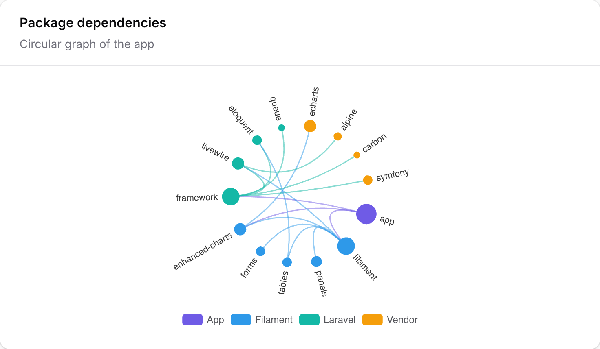 | 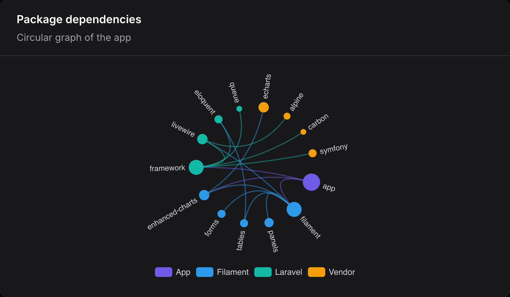 |

<details>
<summary>Widget code</summary>

```php
use Happenv\FilamentEnhancedCharts\Option\Component\Legend;
use Happenv\FilamentEnhancedCharts\Option\Option;
use Happenv\FilamentEnhancedCharts\Option\Series\GraphSeries;
use Happenv\FilamentEnhancedCharts\Option\Style\LineStyle;
use Happenv\FilamentEnhancedCharts\Widgets\EnhancedChartWidget;

class GraphChart extends EnhancedChartWidget
{
    protected static ?string $heading = 'Package dependencies';

    protected static ?string $subheading = 'Circular graph of the app';

    protected ?string $pollingInterval = null;

    protected function getOption(): Option
    {
        $node = fn (string $name, int $category, int $size): array => ['name' => $name, 'category' => $category, 'symbolSize' => $size];

        return Option::make()
            ->color('#6f5be6', '#2e99e9', '#14b8a6', '#f59e0b')
            ->legend(Legend::make()->bottom(0)->data(['App', 'Filament', 'Laravel', 'Vendor']))
            ->series(
                GraphSeries::make()
                    ->layout('circular')
                    ->circular(['rotateLabel' => true])
                    ->top(16)->bottom(48)
                    ->zoom(0.72)
                    ->categories([['name' => 'App'], ['name' => 'Filament'], ['name' => 'Laravel'], ['name' => 'Vendor']])
                    ->label(['show' => true, 'position' => 'right', 'fontSize' => 11])
                    ->lineStyle(LineStyle::make()->color('source')->opacity(0.5)->width(1.5)->curveness(0.3))
                    ->data([
                        $node('app', 0, 30), $node('filament', 1, 26), $node('panels', 1, 16), $node('tables', 1, 14),
                        $node('forms', 1, 14), $node('enhanced-charts', 1, 18), $node('framework', 2, 26), $node('livewire', 2, 18),
                        $node('eloquent', 2, 14), $node('queue', 2, 10), $node('echarts', 3, 18), $node('alpine', 3, 12),
                        $node('carbon', 3, 10), $node('symfony', 3, 14),
                    ])
                    ->links([
                        ['source' => 'app', 'target' => 'filament'], ['source' => 'app', 'target' => 'framework'],
                        ['source' => 'app', 'target' => 'enhanced-charts'], ['source' => 'filament', 'target' => 'panels'],
                        ['source' => 'filament', 'target' => 'tables'], ['source' => 'filament', 'target' => 'forms'],
                        ['source' => 'filament', 'target' => 'livewire'], ['source' => 'enhanced-charts', 'target' => 'echarts'],
                        ['source' => 'enhanced-charts', 'target' => 'filament'], ['source' => 'livewire', 'target' => 'alpine'],
                        ['source' => 'livewire', 'target' => 'framework'], ['source' => 'framework', 'target' => 'eloquent'],
                        ['source' => 'framework', 'target' => 'queue'], ['source' => 'framework', 'target' => 'symfony'],
                        ['source' => 'framework', 'target' => 'carbon'], ['source' => 'tables', 'target' => 'eloquent'],
                    ]),
            );
    }
}
```

</details>

### Force layout (animated)

_Team collaboration — Force-directed layout, animated and draggable_

| Light | Dark |
|:---:|:---:|
| 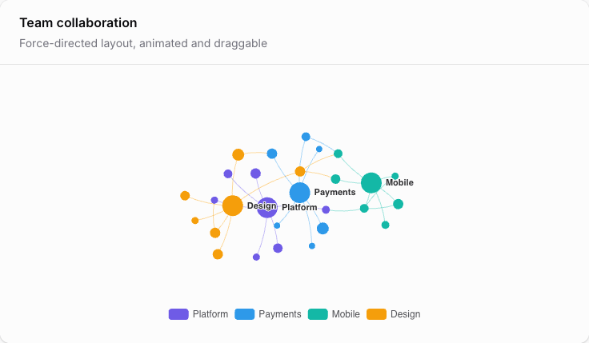 | 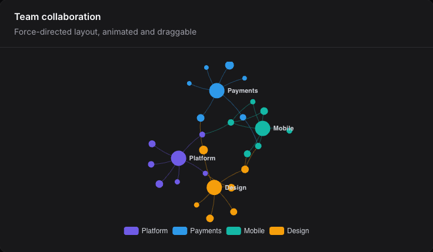 |

<details>
<summary>Widget code</summary>

```php
use Happenv\FilamentEnhancedCharts\Option\Component\Legend;
use Happenv\FilamentEnhancedCharts\Option\Option;
use Happenv\FilamentEnhancedCharts\Option\Series\GraphSeries;
use Happenv\FilamentEnhancedCharts\Option\Style\Force;
use Happenv\FilamentEnhancedCharts\Option\Style\LineStyle;
use Happenv\FilamentEnhancedCharts\Widgets\EnhancedChartWidget;

class GraphForceChart extends EnhancedChartWidget
{
    protected static ?string $heading = 'Team collaboration';

    protected static ?string $subheading = 'Force-directed layout, animated and draggable';

    protected ?string $pollingInterval = null;

    protected function getOption(): Option
    {
        mt_srand(8);
        $teams = ['Platform', 'Payments', 'Mobile', 'Design'];
        $nodes = [];
        $links = [];

        foreach ($teams as $c => $team) {
            $nodes[] = ['name' => $team, 'category' => $c, 'symbolSize' => 26];

            foreach (range(1, 6) as $i) {
                $nodes[] = ['name' => "{$team} {$i}", 'category' => $c, 'symbolSize' => mt_rand(8, 15), 'label' => ['show' => false]];
                $links[] = ['source' => $team, 'target' => "{$team} {$i}"];
            }
        }

        foreach (range(1, 8) as $_) {
            $links[] = ['source' => $teams[mt_rand(0, 3)] . ' ' . mt_rand(1, 6), 'target' => $teams[mt_rand(0, 3)] . ' ' . mt_rand(1, 6)];
        }

        return Option::make()
            ->color('#6f5be6', '#2e99e9', '#14b8a6', '#f59e0b')
            ->legend(Legend::make()->bottom(0)->data($teams))
            ->series(
                GraphSeries::make()
                    ->layout('force')
                    ->top(12)->bottom(40)
                    ->roam()
                    ->draggable()
                    ->force(Force::make()->repulsion(90)->gravity(0.12)->edgeLength(30))
                    ->categories(array_map(fn (string $t): array => ['name' => $t], $teams))
                    ->label(['show' => true, 'position' => 'right', 'fontSize' => 11, 'fontWeight' => 600])
                    ->lineStyle(LineStyle::make()->color('source')->opacity(0.4)->curveness(0.1))
                    ->data($nodes)
                    ->links($links),
            );
    }
}
```

</details>

[↑ Contents](#contents)

## Parallel

`ParallelSeries` — Many dimensions per item on parallel axes.

### Parallel coordinates

_Product comparison — Every line is one product_

| Light | Dark |
|:---:|:---:|
| 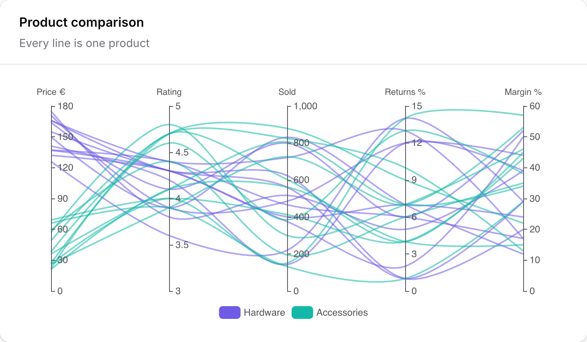 | 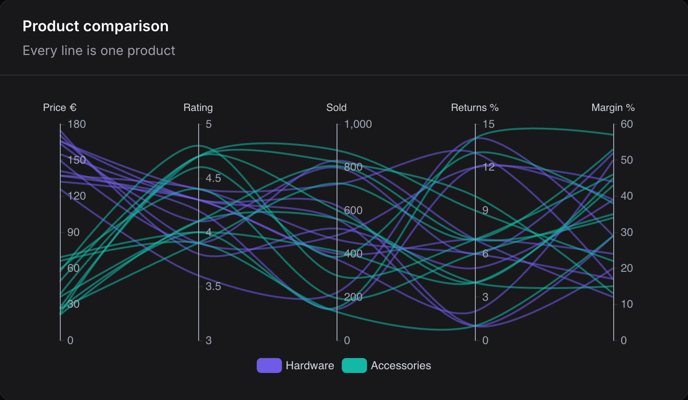 |

<details>
<summary>Widget code</summary>

```php
use Happenv\FilamentEnhancedCharts\Option\Component\Legend;
use Happenv\FilamentEnhancedCharts\Option\Component\Parallel;
use Happenv\FilamentEnhancedCharts\Option\Component\ParallelAxis;
use Happenv\FilamentEnhancedCharts\Option\Option;
use Happenv\FilamentEnhancedCharts\Option\Series\ParallelSeries;
use Happenv\FilamentEnhancedCharts\Option\Style\LineStyle;
use Happenv\FilamentEnhancedCharts\Widgets\EnhancedChartWidget;

class ParallelChart extends EnhancedChartWidget
{
    protected static ?string $heading = 'Product comparison';

    protected static ?string $subheading = 'Every line is one product';

    protected ?string $pollingInterval = null;

    protected function getOption(): Option
    {
        mt_srand(3);
        $products = fn (int $price, int $rating): array => array_map(fn (): array => [
            $price + mt_rand(-25, 25), round($rating / 10 + mt_rand(-6, 6) / 10, 1), mt_rand(80, 900), mt_rand(1, 14), mt_rand(12, 58),
        ], range(1, 12));

        return Option::make()
            ->legend(Legend::make()->bottom(0))
            ->parallel(Parallel::make()->left(40)->right(56)->top(28)->bottom(40)->parallelAxisDefault(['nameGap' => 12, 'nameTextStyle' => ['fontSize' => 11]]))
            ->parallelAxis(
                ParallelAxis::make()->dim(0)->name('Price €'),
                ParallelAxis::make()->dim(1)->name('Rating')->min(3)->max(5),
                ParallelAxis::make()->dim(2)->name('Sold'),
                ParallelAxis::make()->dim(3)->name('Returns %'),
                ParallelAxis::make()->dim(4)->name('Margin %'),
            )
            ->series(
                ParallelSeries::make()->name('Hardware')->color('#6f5be6')->smooth()->lineStyle(LineStyle::make()->width(2)->opacity(0.55))->data($products(150, 42)),
                ParallelSeries::make()->name('Accessories')->color('#14b8a6')->smooth()->lineStyle(LineStyle::make()->width(2)->opacity(0.55))->data($products(45, 45)),
            );
    }
}
```

</details>

[↑ Contents](#contents)

## Theme river

`ThemeRiverSeries` — Stacked streams over time around a central axis.

### Streams over time

_Support topics — Tickets per topic over the quarter_

| Light | Dark |
|:---:|:---:|
| 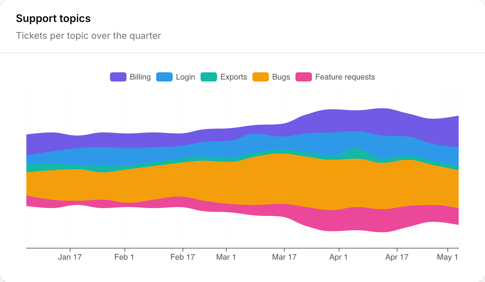 | 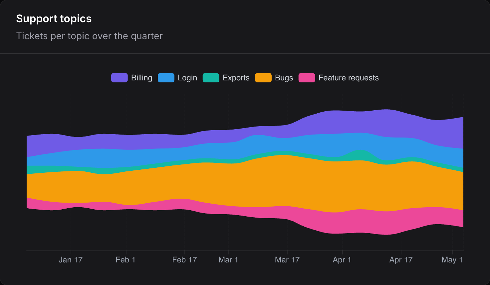 |

<details>
<summary>Widget code</summary>

```php
use Carbon\CarbonImmutable;
use Happenv\FilamentEnhancedCharts\Option\Component\Legend;
use Happenv\FilamentEnhancedCharts\Option\Component\SingleAxis;
use Happenv\FilamentEnhancedCharts\Option\Component\Tooltip;
use Happenv\FilamentEnhancedCharts\Option\Option;
use Happenv\FilamentEnhancedCharts\Option\Series\ThemeRiverSeries;
use Happenv\FilamentEnhancedCharts\Widgets\EnhancedChartWidget;

class ThemeRiverChart extends EnhancedChartWidget
{
    protected static ?string $heading = 'Support topics';

    protected static ?string $subheading = 'Tickets per topic over the quarter';

    protected ?string $pollingInterval = null;

    protected function getOption(): Option
    {
        return Option::make()
            ->color('#6f5be6', '#2e99e9', '#14b8a6', '#f59e0b', '#ec4899')
            ->tooltip(Tooltip::make()->trigger('axis')->axisPointer(['type' => 'line']))
            ->legend(Legend::make()->top(0))
            ->singleAxis(SingleAxis::make()->type('time')->top(36)->bottom(28)->left(16)->right(16)->axisLabel(['formatter' => '{MMM} {d}']))
            ->series(ThemeRiverSeries::make()->label(['show' => false])->data($this->tickets()));
    }

    /** @return list<array{string, int, string}> */
    private function tickets(): array
    {
        mt_srand(11);
        $rows = [];

        foreach (['Billing' => 9, 'Login' => 6, 'Exports' => 5, 'Bugs' => 8, 'Feature requests' => 7] as $topic => $base) {
            $value = $base;

            foreach (range(0, 17) as $week) {
                $value = max(2, $value + mt_rand(-3, 3));
                $rows[] = [CarbonImmutable::parse('2026-01-05')->addWeeks($week)->toDateString(), $value, $topic];
            }
        }

        return $rows;
    }
}
```

</details>

[↑ Contents](#contents)

## Pictorial bar

`PictorialBarSeries` — Bars drawn with repeated or clipped symbols.

### Repeated symbols

_Sprint goals — Story points delivered out of 40_

| Light | Dark |
|:---:|:---:|
| 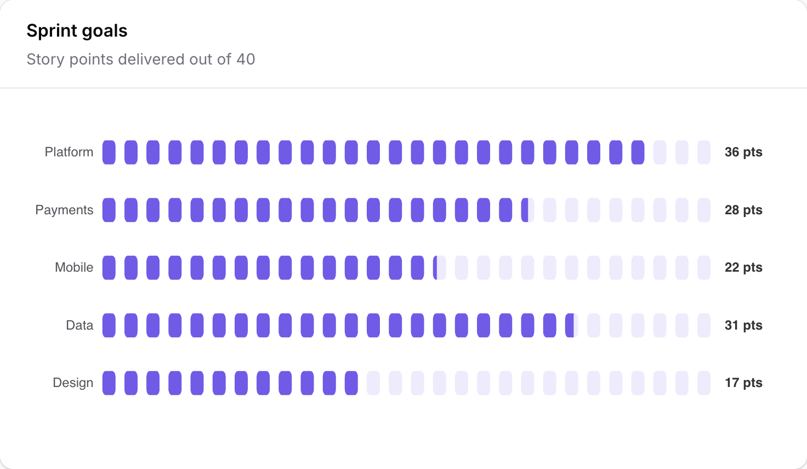 | 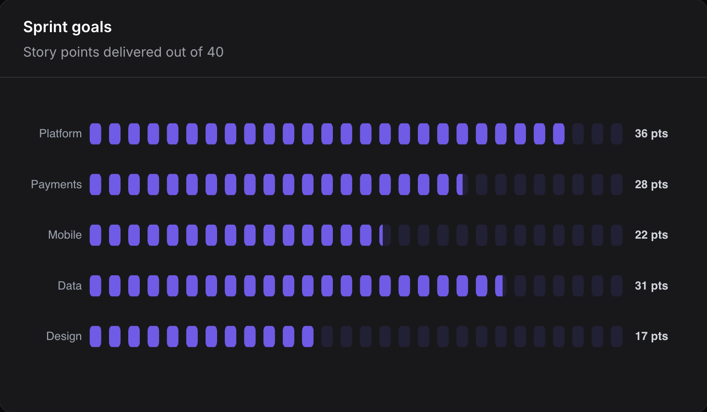 |

<details>
<summary>Widget code</summary>

```php
use Happenv\FilamentEnhancedCharts\Option\Axis\CategoryAxis;
use Happenv\FilamentEnhancedCharts\Option\Axis\ValueAxis;
use Happenv\FilamentEnhancedCharts\Option\Component\Grid;
use Happenv\FilamentEnhancedCharts\Option\Option;
use Happenv\FilamentEnhancedCharts\Option\Series\PictorialBarSeries;
use Happenv\FilamentEnhancedCharts\Option\Style\ItemStyle;
use Happenv\FilamentEnhancedCharts\Widgets\EnhancedChartWidget;

class PictorialBarChart extends EnhancedChartWidget
{
    protected static ?string $heading = 'Sprint goals';

    protected static ?string $subheading = 'Story points delivered out of 40';

    protected ?string $pollingInterval = null;

    protected function getOption(): Option
    {
        $teams = ['Platform', 'Payments', 'Mobile', 'Data', 'Design'];
        $points = [36, 28, 22, 31, 17];

        return Option::make()
            ->xAxis(ValueAxis::make()->max(40)->show(false))
            ->yAxis(CategoryAxis::make()->inverse()->data($teams)->axisLine(false)->axisTick(false))
            ->grid(Grid::make()->left(8)->right(64)->top(8)->bottom(8))
            ->series(
                PictorialBarSeries::make()
                    ->symbol('roundRect')
                    ->symbolRepeat('fixed')
                    ->symbolMargin('35%')
                    ->symbolClip()
                    ->symbolSize([12, 22])
                    ->symbolBoundingData(40)
                    ->color('#6f5be6')
                    ->label(['show' => true, 'position' => 'right', 'offset' => [8, 0], 'formatter' => '{c} pts', 'fontWeight' => 600])
                    ->z(10)
                    ->data($points),
                PictorialBarSeries::make()
                    ->symbol('roundRect')
                    ->symbolRepeat('fixed')
                    ->symbolMargin('35%')
                    ->symbolSize([12, 22])
                    ->symbolBoundingData(40)
                    ->itemStyle(ItemStyle::make()->color('#6f5be6')->opacity(0.12))
                    ->silent()
                    ->data(array_fill(0, count($teams), 40)),
            );
    }
}
```

</details>

[↑ Contents](#contents)

## Map

`MapSeries` — Regions of any GeoJSON coloured by value. The screenshots use a hand-made hexagonal tile map of Europe; register your own GeoJSON through `getMaps()`.

### Hexagonal tile map

_Active users in Europe — Hexagonal tile map, thousands_

| Light | Dark |
|:---:|:---:|
| 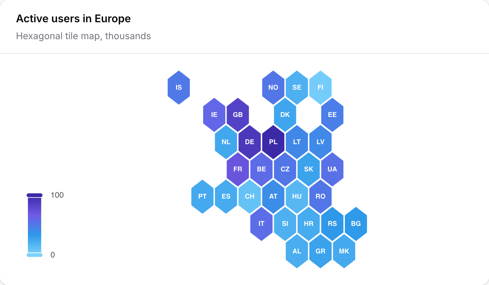 | 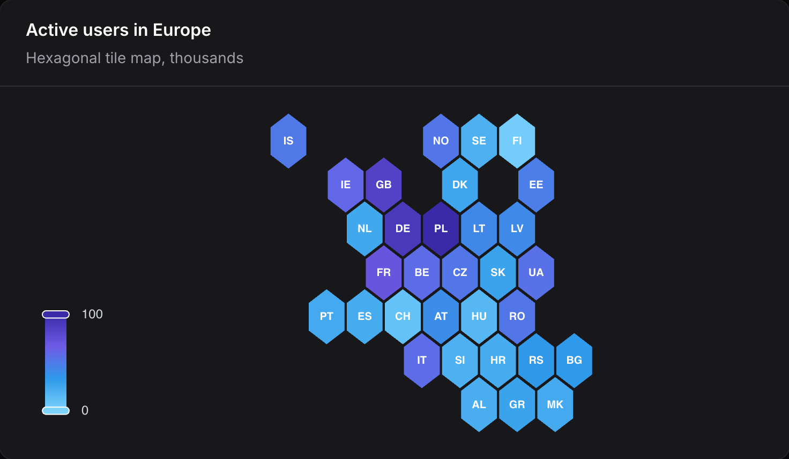 |

<details>
<summary>Widget code</summary>

```php
use Happenv\FilamentEnhancedCharts\Option\Component\Tooltip;
use Happenv\FilamentEnhancedCharts\Option\Component\VisualMap;
use Happenv\FilamentEnhancedCharts\Option\Option;
use Happenv\FilamentEnhancedCharts\Option\Series\MapSeries;
use Happenv\FilamentEnhancedCharts\Option\Style\ItemStyle;
use Happenv\FilamentEnhancedCharts\Widgets\EnhancedChartWidget;

class MapChart extends EnhancedChartWidget
{
    protected static ?string $heading = 'Active users in Europe';

    protected static ?string $subheading = 'Hexagonal tile map, thousands';

    protected ?string $pollingInterval = null;

    /** @return array<string, string> */
    public function getMaps(): array
    {
        return ['europe-tiles' => asset('geo/europe-tiles.json')];
    }

    protected function getOption(): Option
    {
        mt_srand(5);
        $users = collect(['IS', 'NO', 'SE', 'FI', 'IE', 'GB', 'DK', 'EE', 'NL', 'DE', 'PL', 'LT', 'LV', 'FR', 'BE', 'CZ', 'SK', 'UA', 'PT', 'ES', 'CH', 'AT', 'HU', 'RO', 'IT', 'SI', 'HR', 'RS', 'BG', 'GR', 'AL', 'MK'])
            ->map(fn (string $code): array => ['name' => $code, 'value' => in_array($code, ['PL', 'DE', 'GB', 'FR'], true) ? mt_rand(70, 100) : mt_rand(4, 60)])
            ->all();

        return Option::make()
            ->tooltip(Tooltip::make()->trigger('item')->formatter('{b}: {c}k'))
            ->visualMap(VisualMap::continuous()->min(0)->max(100)->orient('vertical')->left(0)->bottom(0)->itemHeight(90)->calculable()->inRange(['color' => ['#7dd3fc', '#2e99e9', '#6f5be6', '#3b2aa8']]))
            ->series(
                MapSeries::make()
                    ->map('europe-tiles')
                    ->roam(false)
                    ->itemStyle(ItemStyle::make()->borderWidth(0))
                    ->label(['show' => true, 'fontSize' => 10, 'fontWeight' => 600, 'color' => '#ffffff'])
                    ->emphasis(['label' => ['color' => '#ffffff'], 'itemStyle' => ['areaColor' => '#f59e0b']])
                    ->raw(['layoutCenter' => ['55%', '50%'], 'layoutSize' => '100%'])
                    ->data($users),
            );
    }
}
```

</details>

[↑ Contents](#contents)

## Lines

`LinesSeries` — Routes between coordinates, with animated trails — here on the same GeoJSON as the map above.

### Animated routes on a map

_Shipments — Live routes from the Warsaw hub_

| Light | Dark |
|:---:|:---:|
| 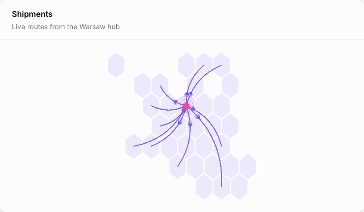 | 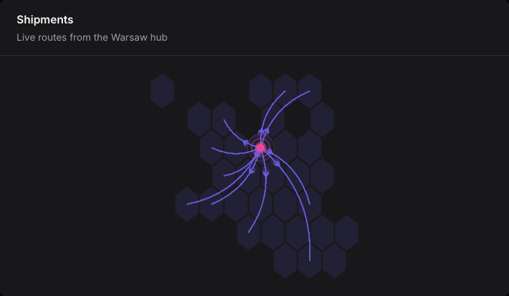 |

<details>
<summary>Widget code</summary>

```php
use Happenv\FilamentEnhancedCharts\Option\Component\Geo;
use Happenv\FilamentEnhancedCharts\Option\Option;
use Happenv\FilamentEnhancedCharts\Option\Series\EffectScatterSeries;
use Happenv\FilamentEnhancedCharts\Option\Series\LinesSeries;
use Happenv\FilamentEnhancedCharts\Option\Style\ItemStyle;
use Happenv\FilamentEnhancedCharts\Option\Style\LinesEffect;
use Happenv\FilamentEnhancedCharts\Option\Style\LineStyle;
use Happenv\FilamentEnhancedCharts\Widgets\EnhancedChartWidget;

class LinesChart extends EnhancedChartWidget
{
    protected static ?string $heading = 'Shipments';

    protected static ?string $subheading = 'Live routes from the Warsaw hub';

    protected ?string $pollingInterval = null;

    /** @return array<string, string> */
    public function getMaps(): array
    {
        return ['europe-tiles' => asset('geo/europe-tiles.json')];
    }

    protected function getOption(): Option
    {
        $hub = $this->centre('PL');
        $routes = array_map(fn (string $code): array => ['coords' => [$hub, $this->centre($code)]], ['GB', 'ES', 'IT', 'SE', 'FI', 'FR', 'GR', 'RO', 'NL', 'PT']);

        return Option::make()
            ->geo(
                Geo::make()
                    ->map('europe-tiles')
                    ->silent()
                    ->itemStyle(ItemStyle::make()->areaColor('rgba(111, 91, 230, 0.12)')->borderWidth(0))
                    ->raw(['layoutCenter' => ['50%', '50%'], 'layoutSize' => '100%']),
            )
            ->series(
                LinesSeries::make()
                    ->coordinateSystem('geo')
                    ->effect(LinesEffect::make()->show()->period(4)->trailLength(0.25)->symbol('arrow')->symbolSize(7))
                    ->lineStyle(LineStyle::make()->color('#6f5be6')->width(1.5)->opacity(0.5)->curveness(0.25))
                    ->data($routes),
                EffectScatterSeries::make()
                    ->coordinateSystem('geo')
                    ->color('#ec4899')
                    ->symbolSize(12)
                    ->rippleEffect(['scale' => 4, 'brushType' => 'stroke'])
                    ->data([['name' => 'Warsaw', 'value' => $hub]]),
            );
    }

    /** @return array{float, float} */
    private function centre(string $code): array
    {
        $features = json_decode(file_get_contents(public_path('geo/europe-tiles.json')), true)['features'];

        return collect($features)->firstWhere('properties.name', $code)['properties']['cp'];
    }
}
```

</details>

[↑ Contents](#contents)

## Chord

`ChordSeries` — Relationships between nodes on a ring, as ribbons sized by value (ECharts 6).

### Chord diagram

_Code reviews between teams — Pull requests reviewed across teams this quarter_

| Light | Dark |
|:---:|:---:|
| 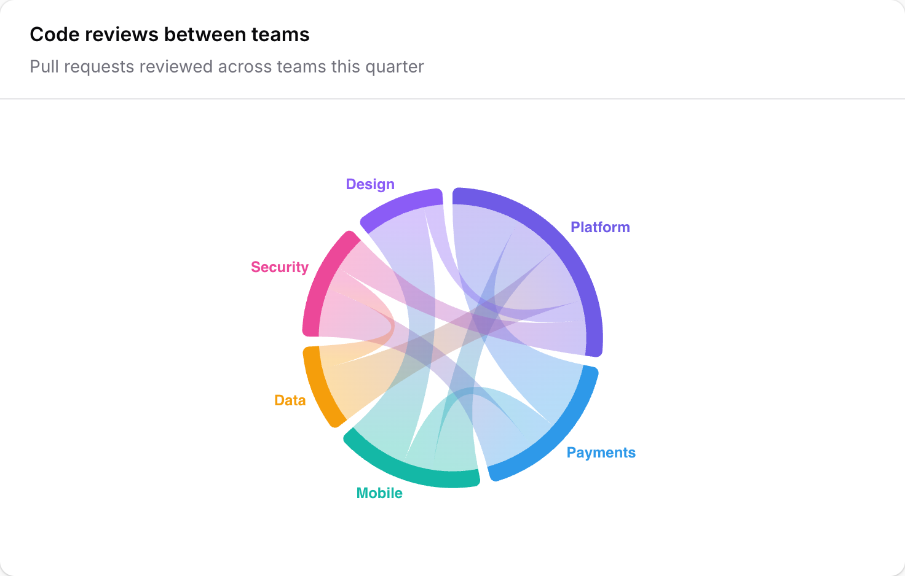 | 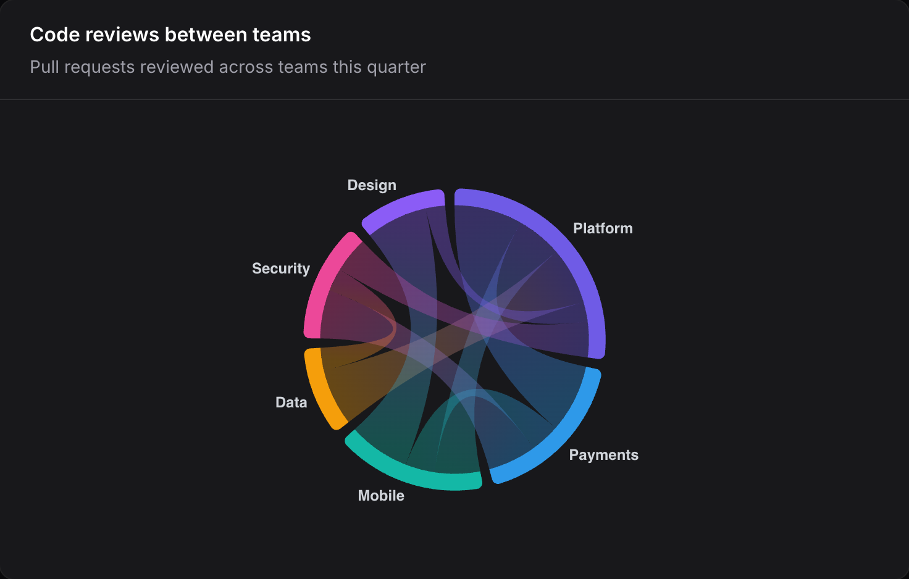 |

<details>
<summary>Widget code</summary>

```php
use Happenv\FilamentEnhancedCharts\Option\Component\Tooltip;
use Happenv\FilamentEnhancedCharts\Option\Option;
use Happenv\FilamentEnhancedCharts\Option\Series\ChordSeries;
use Happenv\FilamentEnhancedCharts\Option\Style\Emphasis;
use Happenv\FilamentEnhancedCharts\Option\Style\LineStyle;
use Happenv\FilamentEnhancedCharts\Widgets\EnhancedChartWidget;

class ChordChart extends EnhancedChartWidget
{
    protected static ?string $heading = 'Code reviews between teams';

    protected static ?string $subheading = 'Pull requests reviewed across teams this quarter';

    protected static int $contentHeight = 340;

    protected ?string $pollingInterval = null;

    protected function getOption(): Option
    {
        return Option::make()
            ->color('#6f5be6', '#2e99e9', '#14b8a6', '#f59e0b', '#ec4899', '#8b5cf6')
            ->tooltip(Tooltip::make()->trigger('item'))
            ->series(
                ChordSeries::make()
                    ->radius(['64%', '72%'])
                    ->center(['50%', '50%'])
                    ->padAngle(4)
                    ->minAngle(8)
                    ->lineStyle(LineStyle::make()->color('gradient')->opacity(0.35))
                    ->label(['position' => 'outside', 'fontSize' => 12, 'fontWeight' => 600])
                    ->emphasis(Emphasis::make()->focus('adjacency'))
                    ->links([
                        ['source' => 'Platform', 'target' => 'Payments', 'value' => 42],
                        ['source' => 'Platform', 'target' => 'Mobile', 'value' => 28],
                        ['source' => 'Platform', 'target' => 'Data', 'value' => 35],
                        ['source' => 'Payments', 'target' => 'Mobile', 'value' => 18],
                        ['source' => 'Payments', 'target' => 'Security', 'value' => 30],
                        ['source' => 'Mobile', 'target' => 'Design', 'value' => 38],
                        ['source' => 'Data', 'target' => 'Security', 'value' => 14],
                        ['source' => 'Design', 'target' => 'Platform', 'value' => 12],
                        ['source' => 'Security', 'target' => 'Platform', 'value' => 22],
                    ]),
            );
    }
}
```

</details>

[↑ Contents](#contents)

## Custom

`CustomSeries` — Anything else, drawn by your own renderItem function.

### Gantt chart via renderItem

_Release plan — Gantt chart drawn with a custom renderItem_

| Light | Dark |
|:---:|:---:|
| 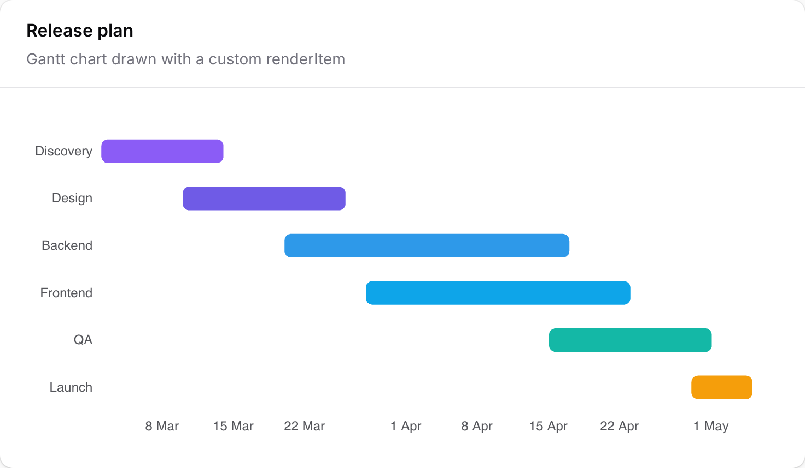 | 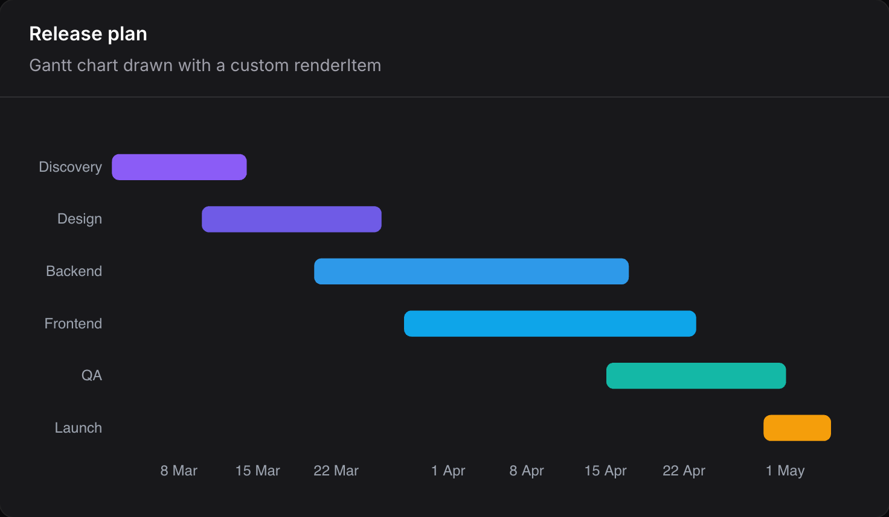 |

<details>
<summary>Widget code</summary>

```php
use Carbon\CarbonImmutable;
use Filament\Support\RawJs;
use Happenv\FilamentEnhancedCharts\Option\Axis\CategoryAxis;
use Happenv\FilamentEnhancedCharts\Option\Axis\TimeAxis;
use Happenv\FilamentEnhancedCharts\Option\Component\Grid;
use Happenv\FilamentEnhancedCharts\Option\Component\Tooltip;
use Happenv\FilamentEnhancedCharts\Option\Option;
use Happenv\FilamentEnhancedCharts\Option\Series\CustomSeries;
use Happenv\FilamentEnhancedCharts\Widgets\EnhancedChartWidget;

class CustomChart extends EnhancedChartWidget
{
    protected static ?string $heading = 'Release plan';

    protected static ?string $subheading = 'Gantt chart drawn with a custom renderItem';

    protected ?string $pollingInterval = null;

    protected function getOption(): Option
    {
        $tasks = ['Discovery', 'Design', 'Backend', 'Frontend', 'QA', 'Launch'];
        $colors = ['#8b5cf6', '#6f5be6', '#2e99e9', '#0ea5e9', '#14b8a6', '#f59e0b'];
        $plan = [[0, 0, 12], [1, 8, 24], [2, 18, 46], [3, 26, 52], [4, 44, 60], [5, 58, 64]];
        $day = fn (int $offset): int => CarbonImmutable::parse('2026-03-02')->addDays($offset)->getTimestampMs();

        return Option::make()
            ->tooltip(Tooltip::make()->trigger('item')->formatter('{b}'))
            ->grid(Grid::make()->left(8)->right(24)->top(12)->bottom(8))
            ->xAxis(TimeAxis::make()->splitNumber(6)->axisLabel(['formatter' => '{d} {MMM}', 'hideOverlap' => true])->splitLine(['lineStyle' => ['type' => 'dashed']]))
            ->yAxis(CategoryAxis::make()->inverse()->data($tasks)->axisTick(false)->axisLine(false))
            ->series(
                CustomSeries::make()
                    ->encode(['x' => [1, 2], 'y' => 0])
                    ->renderItem(RawJs::make(<<<'JS'
                        (params, api) => {
                            const row = api.value(0);
                            const start = api.coord([api.value(1), row]);
                            const end = api.coord([api.value(2), row]);
                            const height = api.size([0, 1])[1] * 0.5;
                            return {
                                type: 'rect',
                                shape: { x: start[0], y: start[1] - height / 2, width: end[0] - start[0], height, r: 6 },
                                style: { fill: api.visual('color') },
                            };
                        }
                        JS))
                    ->data(array_map(fn (array $t): array => [
                        'name' => $tasks[$t[0]],
                        'value' => [$t[0], $day($t[1]), $day($t[2])],
                        'itemStyle' => ['color' => $colors[$t[0]]],
                    ], $plan)),
            );
    }
}
```

</details>

[↑ Contents](#contents)
